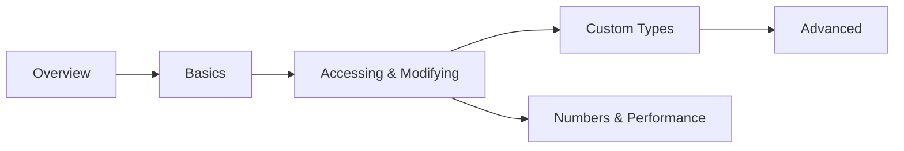

# nlohmann/json Documentation Set Implementation Plan

> **For agentic workers:** REQUIRED SUB-SKILL: Use superpowers:subagent-driven-development (recommended) or superpowers:executing-plans to implement this plan task-by-task. Steps use checkbox (`- [ ]`) syntax for tracking.

**Goal:** Add a comprehensive, boost-style documentation set for `nlohmann/json` at `docs/programming/nlohmann-json/` (22 topic pages + overview), wired into the autogenerated `programming` sidebar.

**Architecture:** Task 1 creates the whole skeleton — folder, all `_category_.json` files, `readme.md`, and every topic `.md` as a valid stub (frontmatter + H1 + one framing sentence). Every later task fleshes out exactly one numbered subfolder to full depth. This ordering means `npm run build` (with `onBrokenLinks: "throw"`) passes after *every* task, because all link targets exist from Task 1 onward.

**Tech Stack:** Docusaurus 3.9 Markdown (MDX), Docusaurus admonitions, Mermaid (`@docusaurus/theme-mermaid`), Prism code fences, `<Icon icon="lucide:..." inline />` from the site's swizzled Icon component.

## Global Constraints

These apply to **every** page this plan creates. They are always in force and are not restated per task.

- **Folder position:** `docs/programming/nlohmann-json/_category_.json` gets `"position": 6` (existing siblings: `cpp`=2, `python`=3, `cmake`=4, `boost`=5). Label is exactly `"nlohmann/json"`.
- **JSON files are tab-indented** — every existing `_category_.json` in this repo uses a literal tab. Match it. (Biome's 2-space setting targets JS/TS; do not reformat these files.)
- **Subfolder `_category_.json` scheme** (copied from `docs/programming/cmake/*/`): folder `NN-name` gets `"label": "<NN+1>. <Human name>"` and `"position": <NN+2>`. So `00-overview` → label `"1. Overview"`, position `2`.
- **`readme.md` frontmatter** has `title`, `sidebar_label: Overview`, `sidebar_position: 1`, `tags` — **no `id`** (matches `boost/readme.md`, `cmake/readme.md`).
- **Topic page frontmatter** is exactly:
  ```md
  ---
  id: <kebab-case-id>
  title: <Human Title>
  sidebar_label: <short label>
  sidebar_position: <int, starts at 1 within its folder>
  tags: [c++, nlohmann-json, <topic-tag>, <topic-tag>]
  ---
  ```
- **Tags** always start `c++, nlohmann-json`, then 1-3 lowercase hyphenated topic tags.
- **Every topic page** opens with `# H1` matching `title`, then 1-2 prose paragraphs on *why this exists / what problem it solves* before any API detail, then `##` sections (`###` sparingly), and ends with a `## See also` list of 3-5 bullets in this exact shape:
  `- <Icon icon="lucide:xyz" inline /> [Link text](./relative-path.md) — one-line reason to go there.`
  Order: siblings first, then cross-folder, then `../readme.md` last.
- **Admonitions** — only these four, with these meanings: `:::info[...]` framing why a feature exists; `:::tip[...]` idiomatic usage / best practice; `:::danger[...]` UB and footguns; `:::note[...]` "which should I use", migration, version caveats.
- **Code fences:** ` ```cpp ` (or ` ```bash `, ` ```cmake `, ` ```json `). Add `showLineNumbers` to any snippet longer than ~5 lines. Add `title="filename.cpp"` when the snippet is a real standalone file. Snippets must be conceptually compilable — correct `#include <nlohmann/json.hpp>`, no hand-waved syntax.
- **`json` fences require a config change** — `prism.additionalLanguages` in `docusaurus.config.js:195` is currently `["bash", "cmake", "csharp", "ini", "python"]`. Task 1 adds `"json"`.
- **Voice:** precise, technical, conversational but not casual, willing to state opinions ("prefer X unless Y"). Every "how" paired with a "why" or a "when".
- **Comparison tables** (`| Feature | Option A | Option B |`) are mandatory wherever a page's job is to help the reader choose.
- **Never** add a `Co-Authored-By` trailer or "Generated with Claude Code" line to commits (`CLAUDE.md`). Commit messages are one line, `<type>: <what>`.
- **Verification gate for every task:** `npm run build` must exit 0. That is this repo's only correctness gate — it validates internal links, MDX syntax, and admonition syntax.

---

## File Structure

```
docs/programming/nlohmann-json/
├── _category_.json                     label "nlohmann/json", position 6
├── readme.md                           landing page: sections table, reading paths, quick reference
├── 00-overview/                        what it is, install, philosophy, alternatives
├── 01-basics/                          parse, construct, the value type, dump
├── 02-accessing-and-modifying/         access, iterate, convert, pointer/patch, merge
├── 03-custom-type-conversion/          to_json/from_json, macros, adl_serializer
├── 04-advanced-features/               SAX, binary formats, exceptions
└── 05-numbers-memory-and-performance/  numbers, allocators, performance
```

`docusaurus.config.js` is modified once (Task 1) to add `"json"` to `prism.additionalLanguages`. No sidebar edit is needed — `sidebars.js` autogenerates from `dirName: "programming"`.

---

### Task 1: Skeleton — folders, categories, stubs, config

Creates every file the rest of the plan will fill in, so that all cross-links resolve from here on.

**Files:**
- Create: `docs/programming/nlohmann-json/_category_.json`
- Create: `docs/programming/nlohmann-json/readme.md`
- Create: `docs/programming/nlohmann-json/{00-overview,01-basics,02-accessing-and-modifying,03-custom-type-conversion,04-advanced-features,05-numbers-memory-and-performance}/_category_.json`
- Create: 22 stub `.md` files (listed below)
- Modify: `docusaurus.config.js:195`

**Interfaces:**
- Consumes: nothing.
- Produces: the exact file paths and frontmatter `id`/`title`/`sidebar_position` values that Tasks 2-7 fill in, and that every `See also` link in this plan targets.

- [ ] **Step 1: Create the folder `_category_.json` (tab-indented)**

`docs/programming/nlohmann-json/_category_.json`:
```json
{
	"label": "nlohmann/json",
	"position": 6,
	"link": {
		"type": "generated-index"
	}
}
```

- [ ] **Step 2: Create the six subfolder `_category_.json` files (tab-indented)**

`00-overview/_category_.json`:
```json
{
	"label": "1. Overview",
	"position": 2,
	"link": {
		"type": "generated-index"
	}
}
```
Same shape for the rest, changing only label and position:
- `01-basics/` → `"label": "2. Basics"`, `"position": 3`
- `02-accessing-and-modifying/` → `"label": "3. Accessing and modifying"`, `"position": 4`
- `03-custom-type-conversion/` → `"label": "4. Custom type conversion"`, `"position": 5`
- `04-advanced-features/` → `"label": "5. Advanced features"`, `"position": 6`
- `05-numbers-memory-and-performance/` → `"label": "6. Numbers, memory and performance"`, `"position": 7`

- [ ] **Step 3: Create the 22 topic stubs**

Each stub is frontmatter + H1 + exactly one sentence of framing prose. No `## See also` yet (Tasks 2-7 write the real body). Exact stub shape:

```md
---
id: what-is-nlohmann-json
title: What is nlohmann/json?
sidebar_label: What is nlohmann/json
sidebar_position: 1
tags: [c++, nlohmann-json, overview, introduction]
---

# What is nlohmann/json?

A single-header C++ library that makes JSON feel like a first-class STL container.
```

Create all 22 with exactly these paths, ids, titles, sidebar labels, positions and tags:

**`00-overview/`**
| file | id | title | sidebar_label | pos | tags after `c++, nlohmann-json` |
|---|---|---|---|---|---|
| `what-is-nlohmann-json.md` | `what-is-nlohmann-json` | What is nlohmann/json? | What is nlohmann/json | 1 | `overview, introduction` |
| `installation-and-integration.md` | `installation-and-integration` | Installation and integration | Installation | 2 | `install, cmake, build` |
| `design-philosophy.md` | `design-philosophy` | Design philosophy | Design philosophy | 3 | `design, philosophy, stl` |
| `comparison-with-alternatives.md` | `comparison-with-alternatives` | Comparison with alternatives | Alternatives | 4 | `comparison, rapidjson, simdjson` |

**`01-basics/`**
| file | id | title | sidebar_label | pos | tags after `c++, nlohmann-json` |
|---|---|---|---|---|---|
| `parsing-json.md` | `parsing-json` | Parsing JSON | Parsing | 1 | `parsing, basics` |
| `creating-json-values.md` | `creating-json-values` | Creating JSON values | Creating values | 2 | `construction, basics` |
| `the-json-value-type.md` | `the-json-value-type` | The JSON value type | The value type | 3 | `value-type, basics` |
| `serialization-and-dumping.md` | `serialization-and-dumping` | Serialization and dumping | Serialization | 4 | `serialization, dump` |

**`02-accessing-and-modifying/`**
| file | id | title | sidebar_label | pos | tags after `c++, nlohmann-json` |
|---|---|---|---|---|---|
| `element-access.md` | `element-access` | Element access | Element access | 1 | `access, operator, at` |
| `iterating-json.md` | `iterating-json` | Iterating JSON | Iterating | 2 | `iteration, range-for` |
| `type-checking-and-conversions.md` | `type-checking-and-conversions` | Type checking and conversions | Type checking | 3 | `conversion, type-checking` |
| `json-pointer-and-patch.md` | `json-pointer-and-patch` | JSON Pointer and JSON Patch | Pointer and patch | 4 | `json-pointer, json-patch, rfc` |
| `merging-and-comparison.md` | `merging-and-comparison` | Merging and comparison | Merging | 5 | `merge, comparison` |

**`03-custom-type-conversion/`**
| file | id | title | sidebar_label | pos | tags after `c++, nlohmann-json` |
|---|---|---|---|---|---|
| `to_json-and-from_json.md` | `to-json-and-from-json` | to_json and from_json | to_json / from_json | 1 | `custom-types, adl` |
| `serialization-macros.md` | `serialization-macros` | Serialization macros | Macros | 2 | `custom-types, macros` |
| `adl_serializer-and-templates.md` | `adl-serializer-and-templates` | adl_serializer and template types | adl_serializer | 3 | `custom-types, templates` |

**`04-advanced-features/`**
| file | id | title | sidebar_label | pos | tags after `c++, nlohmann-json` |
|---|---|---|---|---|---|
| `sax-interface.md` | `sax-interface` | The SAX interface | SAX interface | 1 | `sax, parsing, streaming` |
| `binary-formats.md` | `binary-formats` | Binary formats | Binary formats | 2 | `cbor, messagepack, bson` |
| `error-handling-and-exceptions.md` | `error-handling-and-exceptions` | Error handling and exceptions | Error handling | 3 | `exceptions, errors` |

**`05-numbers-memory-and-performance/`**
| file | id | title | sidebar_label | pos | tags after `c++, nlohmann-json` |
|---|---|---|---|---|---|
| `number-handling-and-precision.md` | `number-handling-and-precision` | Number handling and precision | Numbers | 1 | `numbers, precision` |
| `custom-allocators-and-json-types.md` | `custom-allocators-and-json-types` | Custom allocators and JSON types | Custom types | 2 | `allocators, basic-json` |
| `performance-and-best-practices.md` | `performance-and-best-practices` | Performance and best practices | Performance | 3 | `performance, best-practices` |

- [ ] **Step 4: Write the full `readme.md`**

This is the real page, not a stub — every link target now exists. Structure copied from `docs/programming/cmake/readme.md`:

````md
---
title: Overview of nlohmann/json
sidebar_label: Overview
sidebar_position: 1
tags: [c++, nlohmann-json]
---

# nlohmann/json Knowledge Base

<1-2 paragraphs: a single-header C++11 library that models JSON as an STL-like container;
why it became the de facto default for JSON in C++ despite not being the fastest.>

:::info[How this is organised]
<Explain the progression: Overview → Basics get you parsing and printing; Accessing and
Custom type conversion are the day-to-day work; Advanced features and Numbers/memory/performance
are what you reach for when the easy path stops being enough.>
:::

## Sections

|   | Section | What it covers |
|---|---------|----------------|
| <Icon icon="lucide:book-open" inline /> | [Overview](./00-overview/what-is-nlohmann-json.md) | What it is, installing it, design philosophy, how it compares to RapidJSON/simdjson |
| <Icon icon="lucide:wrench" inline /> | [Basics](./01-basics/parsing-json.md) | Parsing, constructing values, the value type, dumping |
| <Icon icon="lucide:pointer" inline /> | [Accessing & Modifying](./02-accessing-and-modifying/element-access.md) | `operator[]` vs `.at()`, iteration, conversions, JSON Pointer/Patch |
| <Icon icon="lucide:shuffle" inline /> | [Custom Type Conversion](./03-custom-type-conversion/to_json-and-from_json.md) | `to_json`/`from_json`, the macros, `adl_serializer` |
| <Icon icon="lucide:layers" inline /> | [Advanced Features](./04-advanced-features/sax-interface.md) | SAX parsing, CBOR/MessagePack/BSON, the exception hierarchy |
| <Icon icon="lucide:gauge" inline /> | [Numbers, Memory & Performance](./05-numbers-memory-and-performance/number-handling-and-precision.md) | Number storage and precision, `basic_json` template parameters, avoiding copies |

## Suggested reading paths



- <Icon icon="lucide:rocket" inline /> **Just need to read a config file:** [Parsing](./01-basics/parsing-json.md) → [Element access](./02-accessing-and-modifying/element-access.md) → [Error handling](./04-advanced-features/error-handling-and-exceptions.md).
- <Icon icon="lucide:shuffle" inline /> **Serializing your own structs:** [to_json/from_json](./03-custom-type-conversion/to_json-and-from_json.md) → [Macros](./03-custom-type-conversion/serialization-macros.md) → [adl_serializer](./03-custom-type-conversion/adl_serializer-and-templates.md).
- <Icon icon="lucide:gauge" inline /> **It's too slow / too big:** [Comparison with alternatives](./00-overview/comparison-with-alternatives.md) → [SAX interface](./04-advanced-features/sax-interface.md) → [Performance](./05-numbers-memory-and-performance/performance-and-best-practices.md).

## Quick reference

```cpp showLineNumbers title="the 90% of the API"
#include <nlohmann/json.hpp>
using json = nlohmann::json;

json j = json::parse(R"({"name":"ada","age":36})");  // parse
std::string name = j.at("name");                     // checked access
int age = j.value("age", 0);                         // access with default
j["tags"] = {"math", "engine"};                      // assign an array
std::string out = j.dump(2);                         // pretty-print, 2-space indent
```

| Task | Call |
|---|---|
| Parse a string | `json::parse(str)` |
| Parse a stream | `json j; ifs >> j;` |
| Access, throwing | `j.at("k")` |
| Access, with default | `j.value("k", fallback)` |
| Type test | `j.is_object()`, `j.is_null()`, … |
| Convert out | `j.get<T>()` / `j.get_to(x)` |
| Serialize | `j.dump()` / `j.dump(indent)` |
````

- [ ] **Step 5: Add `json` to Prism's additional languages**

In `docusaurus.config.js`, line 195, change:
```js
        additionalLanguages: ["bash", "cmake", "csharp", "ini", "python"],
```
to:
```js
        additionalLanguages: ["bash", "cmake", "csharp", "ini", "json", "python"],
```

- [ ] **Step 6: Verify the build passes**

Run: `npm run build`
Expected: exits 0, no `Docusaurus found broken links` error. A new sidebar section "nlohmann/json" is generated after "Boost".

- [ ] **Step 7: Commit**

```bash
git add docs/programming/nlohmann-json docusaurus.config.js
git commit -m "docs: scaffold nlohmann/json doc set"
```

---

### Task 2: 00-overview

**Files:**
- Modify: `docs/programming/nlohmann-json/00-overview/what-is-nlohmann-json.md`
- Modify: `docs/programming/nlohmann-json/00-overview/installation-and-integration.md`
- Modify: `docs/programming/nlohmann-json/00-overview/design-philosophy.md`
- Modify: `docs/programming/nlohmann-json/00-overview/comparison-with-alternatives.md`

**Interfaces:**
- Consumes: the stubs and frontmatter created in Task 1; the `json` Prism language added in Task 1.
- Produces: `./00-overview/*.md` link targets used by `readme.md` and by later folders' `See also` blocks.

- [ ] **Step 1: Write `what-is-nlohmann-json.md`**

Keep the Task 1 frontmatter unchanged. Body sections:
- Opening prose: JSON in C++ before this library (hand-rolled parsers, RapidJSON's DOM/allocator ceremony); what "JSON for Modern C++" set out to change.
- `## One header, C++11, no dependencies` — the two integration shapes (single `json.hpp` drop-in vs `include/` tree). One `bash` fence downloading the single header.
- `## JSON as an STL container` — a `cpp` fence showing `json` behaving like a container (`size()`, `begin()/end()`, `push_back`, `find`).
- `## What it deliberately isn't` — not the fastest parser, not zero-allocation, not streaming-first. `:::note[When to look elsewhere]` pointing at `./comparison-with-alternatives.md`.
- `## A first taste` — a complete `cpp showLineNumbers title="hello_json.cpp"` program: parse a literal, read a field, add a field, `dump(2)` to `std::cout`.
- `## See also` with 4 bullets → `./design-philosophy.md`, `./installation-and-integration.md`, `./comparison-with-alternatives.md`, `../readme.md`.

- [ ] **Step 2: Write `installation-and-integration.md`**

Body sections:
- Opening prose: three integration modes and the trade-off between vendoring one file and depending on a package manager.
- `## The single header` — download `json.hpp`, `#include <nlohmann/json.hpp>`, note on compile-time cost.
- `## The include/ tree` — `nlohmann/json_fwd.hpp` for forward declarations in headers; why that matters for compile times.
- `## CMake: find_package` — a `cmake showLineNumbers title="CMakeLists.txt"` fence with `find_package(nlohmann_json 3.11 REQUIRED)` + `target_link_libraries(app PRIVATE nlohmann_json::nlohmann_json)`.
- `## CMake: FetchContent` — a `cmake showLineNumbers` fence with `FetchContent_Declare` from the GitHub release archive plus `FetchContent_MakeAvailable`. Cross-link `../../cmake/03-dependencies/fetchcontent.md`.
- `## vcpkg and Conan` — one `bash` fence each (`vcpkg install nlohmann-json`, `conan install`).
- `## Which one should I use?` — comparison table `| Method | Best for | Cost |` covering single header / submodule / find_package / FetchContent / vcpkg / Conan. Close with a `:::note[...]` stating a recommendation.
- `## See also` → `./what-is-nlohmann-json.md`, `../01-basics/parsing-json.md`, `../../cmake/03-dependencies/find-package.md`, `../../cmake/03-dependencies/fetchcontent.md`, `../readme.md`.

- [ ] **Step 3: Write `design-philosophy.md`**

Body sections:
- Opening prose: the library's stated goals — intuitive syntax, trivial integration, serious testing — and what each one costs.
- `## "Intuitive syntax" means implicit conversions` — a `cpp` fence showing `std::string s = j["name"];` working, then `:::danger[Implicit conversion is a footgun]` explaining ambiguity and why `get<T>()` is preferable. Forward-link `../02-accessing-and-modifying/type-checking-and-conversions.md`.
- `## STL-like semantics` — value semantics, deep copies, `operator==`; a table `| STL concept | nlohmann/json equivalent |`.
- `## basic_json is a template` — the `json = basic_json<>` alias and `ordered_json`; forward-link `../05-numbers-memory-and-performance/custom-allocators-and-json-types.md`.
- `## The cost of the design` — one header of ~25k lines, compile times, binary size; `:::tip[Use json_fwd.hpp in headers]`.
- `## See also` → `./what-is-nlohmann-json.md`, `./comparison-with-alternatives.md`, `../01-basics/the-json-value-type.md`, `../readme.md`.

- [ ] **Step 4: Write `comparison-with-alternatives.md`**

Body sections:
- Opening prose: all these libraries parse JSON; they differ in what they optimise for.
- `## The field` — one short paragraph each on RapidJSON, Boost.JSON, simdjson, and reflection-based libraries like glaze.
- `## Comparison table` — mandatory:
  `| | nlohmann/json | RapidJSON | Boost.JSON | simdjson |` with rows for parse speed, ergonomics, allocation control, mutability, DOM vs streaming, dependency weight, C++ standard required.
- `## Decision flow` — a `mermaid flowchart`: is parse throughput the bottleneck? → simdjson; already on Boost? → Boost.JSON; need allocator control? → RapidJSON; otherwise → nlohmann/json.
- `## When nlohmann/json is the wrong tool` — gigabyte documents, hard real-time, memory-constrained embedded. `:::note[...]` pointing at `../04-advanced-features/sax-interface.md` as the partial escape hatch.
- Before linking into `boost/`, confirm the target exists: run `ls docs/programming/boost/12-serialization-and-data/`. Link `../../boost/12-serialization-and-data/boost-json.md` if present, otherwise `../../boost/12-serialization-and-data/boost-serialization.md`.
- `## See also` → `./design-philosophy.md`, `./what-is-nlohmann-json.md`, `../05-numbers-memory-and-performance/performance-and-best-practices.md`, `../readme.md`.

- [ ] **Step 5: Verify the build passes**

Run: `npm run build`
Expected: exits 0. If it reports `Docusaurus found broken links`, the failing link is printed with its source page — fix the path and re-run.

- [ ] **Step 6: Commit**

```bash
git add docs/programming/nlohmann-json/00-overview
git commit -m "docs: add nlohmann/json overview section"
```

---

### Task 3: 01-basics

**Files:**
- Modify: `docs/programming/nlohmann-json/01-basics/parsing-json.md`
- Modify: `docs/programming/nlohmann-json/01-basics/creating-json-values.md`
- Modify: `docs/programming/nlohmann-json/01-basics/the-json-value-type.md`
- Modify: `docs/programming/nlohmann-json/01-basics/serialization-and-dumping.md`

**Interfaces:**
- Consumes: `../00-overview/*.md` (written in Task 2) as `See also` targets.
- Produces: `./01-basics/*.md` targets referenced by `readme.md` and by Tasks 4-7.

- [ ] **Step 1: Write `parsing-json.md`**

Body sections:
- Opening prose: parsing is the boundary between untrusted text and typed data — this page covers the ways in and what each does on malformed input.
- `## From a string` — `json::parse(str)`, `cpp` fence.
- `## From a stream` — both `json j; ifs >> j;` and `json::parse(ifs)`; the difference in error reporting.
- `## From iterators / raw bytes` — `json::parse(v.begin(), v.end())` for `std::vector<uint8_t>`.
- `## The _json literal` — `using namespace nlohmann::literals;` and `"..."_json`; `:::tip[...]` that it is sugar for tests and fixtures, not for runtime input.
- `## Parse callbacks and filtering` — the `parser_callback_t` overload; a `cpp showLineNumbers` fence dropping a key during parse.
- `## Failure modes` — `parse_error` and its `byte` offset; the `allow_exceptions = false` overload returning `json::value_t::discarded`; `:::danger[Never parse untrusted input without a size limit]`.
- `## See also` → `./the-json-value-type.md`, `./serialization-and-dumping.md`, `../04-advanced-features/error-handling-and-exceptions.md`, `../04-advanced-features/sax-interface.md`, `../readme.md`.

- [ ] **Step 2: Write `creating-json-values.md`**

Body sections:
- Opening prose: construction is where the library's convenience is loudest — and where its one famous ambiguity lives.
- `## Assignment from C++ values` — `cpp` fence assigning int/double/string/bool/`nullptr`/vector/map.
- `## Initializer-list construction` — `json j = {{"a", 1}, {"b", {1,2,3}}};`.
- `## The array-vs-object ambiguity` — `:::danger[...]` on `{{"a", 1}}` being read as an object while `{1, 2}` is an array, with the disambiguating `json::array({...})` and `json::object({...})` factories and a `cpp` fence showing the surprising case.
- `## Building incrementally` — `push_back`, `emplace_back`, `emplace`, and `operator[]` auto-vivification (forward-link `../02-accessing-and-modifying/element-access.md`).
- `## ordered_json for stable key order` — why default `json` sorts keys and when that matters.
- `## See also` → `./the-json-value-type.md`, `./parsing-json.md`, `../02-accessing-and-modifying/element-access.md`, `../readme.md`.

- [ ] **Step 3: Write `the-json-value-type.md`**

Body sections:
- Opening prose: `json` is one type that is several types at runtime — a tagged union with container semantics.
- `## The value types` — table `| value_t | JSON type | Default C++ storage |` covering null, boolean, number_integer, number_unsigned, number_float, string, array, object, binary, discarded.
- `## The type state machine` — mandatory `mermaid flowchart` showing a null `json` transitioning to object (on `j["k"] = ...`), to array (on `push_back`), and the illegal transitions that throw `type_error`.
- `## Inspecting the type` — `j.type()`, `j.type_name()`, `is_*()`; forward-link `../02-accessing-and-modifying/type-checking-and-conversions.md`.
- `## json vs ordered_json vs custom basic_json` — comparison table `| | json | ordered_json | custom basic_json |` on key order, lookup cost, and when to reach for each; link `../05-numbers-memory-and-performance/custom-allocators-and-json-types.md`.
- `## The binary value type` — only produced by CBOR/MessagePack/BSON round-trips; link `../04-advanced-features/binary-formats.md`.
- `## See also` → `./creating-json-values.md`, `./parsing-json.md`, `../02-accessing-and-modifying/type-checking-and-conversions.md`, `../readme.md`.

- [ ] **Step 4: Write `serialization-and-dumping.md`**

Body sections:
- Opening prose: `dump()` is the inverse of `parse()`, and its defaults are chosen for machines, not humans.
- `## dump() and its parameters` — signature `dump(int indent = -1, char indent_char = ' ', bool ensure_ascii = false, error_handler_t error_handler = error_handler_t::strict)`; a `cpp` fence showing compact vs `dump(2)` vs `dump(4, ' ', true)`, with the resulting output in `json` fences.
- `## Streaming out` — `os << j` and `os << std::setw(4) << j`; `:::tip[std::setw is how you pretty-print to a stream]`.
- `## Invalid UTF-8` — the three `error_handler_t` values (`strict` throws `type_error.316`, `replace`, `ignore`); `:::danger[...]` about dumping strings that came from non-UTF-8 sources.
- `## Number round-tripping` — shortest-round-trip float printing; forward-link `../05-numbers-memory-and-performance/number-handling-and-precision.md`.
- `## See also` → `./parsing-json.md`, `./the-json-value-type.md`, `../04-advanced-features/binary-formats.md`, `../readme.md`.

- [ ] **Step 5: Verify the build passes**

Run: `npm run build`
Expected: exits 0, no broken-link error.

- [ ] **Step 6: Commit**

```bash
git add docs/programming/nlohmann-json/01-basics
git commit -m "docs: add nlohmann/json basics section"
```

---

### Task 4: 02-accessing-and-modifying

**Files:**
- Modify: `docs/programming/nlohmann-json/02-accessing-and-modifying/element-access.md`
- Modify: `docs/programming/nlohmann-json/02-accessing-and-modifying/iterating-json.md`
- Modify: `docs/programming/nlohmann-json/02-accessing-and-modifying/type-checking-and-conversions.md`
- Modify: `docs/programming/nlohmann-json/02-accessing-and-modifying/json-pointer-and-patch.md`
- Modify: `docs/programming/nlohmann-json/02-accessing-and-modifying/merging-and-comparison.md`

**Interfaces:**
- Consumes: `../00-overview/*.md`, `../01-basics/*.md` as link targets.
- Produces: `./02-accessing-and-modifying/*.md` targets used by Tasks 5-7 and `readme.md`.

- [ ] **Step 1: Write `element-access.md`**

Body sections:
- Opening prose: four ways to read a key, three different behaviours on a missing key — pick deliberately.
- `## The four accessors` — mandatory comparison table:
  `| Accessor | Missing key | Wrong type | Const-safe |` with rows for `operator[]`, `.at()`, `.value(key, default)`, `.find(key)`.
- `## Auto-vivification` — `:::danger[Non-const operator[] inserts]` with a `cpp showLineNumbers` fence where a read-looking `j["missing"]` silently creates a null member; show `.at()` and `.contains()` as the fixes.
- `## contains(), find(), count()` — a `cpp` fence; `find` returns `end()` and is the cheapest "check then use".
- `## Arrays` — `operator[]` with an out-of-range index vs `.at()`; `:::danger[...]` — array `operator[]` past the end resizes with nulls, it does not throw.
- `## Erasing` — `erase(key)`, `erase(iterator)`, `erase(index)`.
- `## See also` → `./type-checking-and-conversions.md`, `./iterating-json.md`, `./json-pointer-and-patch.md`, `../01-basics/creating-json-values.md`, `../readme.md`.

- [ ] **Step 2: Write `iterating-json.md`**

Body sections:
- Opening prose: iterating a `json` gives you values, not pairs — the most common surprise in the library.
- `## Range-for over an array` — `cpp` fence.
- `## Range-for over an object gives values only` — `:::danger[...]`; the fix is `.items()`.
- `## .items() and structured bindings` — `for (auto& [key, value] : j.items())`, plus the C++11 fallback `it.key()` / `it.value()`.
- `## Iterator categories and invalidation` — table `| Operation | Invalidates |`.
- `## Iterating nested structures` — a short recursive walk in a `cpp showLineNumbers title="walk.cpp"` fence using `is_structured()`.
- `## See also` → `./element-access.md`, `./type-checking-and-conversions.md`, `../01-basics/the-json-value-type.md`, `../readme.md`.

- [ ] **Step 3: Write `type-checking-and-conversions.md`**

Body sections:
- Opening prose: the conversion surface is where "intuitive syntax" collides with C++ overload resolution.
- `## is_*() predicates` — full list including `is_number_integer` vs `is_number_unsigned` vs `is_number_float`, `is_structured`, `is_primitive`.
- `## get<T>()` — returns by value, throws `type_error` on mismatch; `cpp` fence.
- `## get_to(x)` — fills an existing object, deduces `T`, avoids a copy; `:::tip[Prefer get_to in hot paths]`.
- `## get_ref<T&>() and get_ptr<T*>()` — no-copy access to the stored value; `:::danger[...]` that the reference dangles if the `json` is modified or destroyed.
- `## The implicit conversion operator` — why `std::string s = j;` compiles, why `auto s = j;` does not do what you expect, and `JSON_USE_IMPLICIT_CONVERSIONS=0` to turn it off. `:::danger[...]` with a concrete ambiguity example.
- `## Comparison table` — `| Method | Copies | Throws | Works on const |` for `get<T>`, `get_to`, `get_ref`, `get_ptr`, implicit conversion, `.value()`.
- `## See also` → `./element-access.md`, `../03-custom-type-conversion/to_json-and-from_json.md`, `../01-basics/the-json-value-type.md`, `../readme.md`.

- [ ] **Step 4: Write `json-pointer-and-patch.md`**

Body sections:
- Opening prose: RFC 6901 and RFC 6902 give you addressing and diffing without writing traversal code.
- `## JSON Pointer (RFC 6901)` — `json::json_pointer("/a/b/0")`, `j["/a/b/0"_json_pointer]`, `at()` with a pointer; escaping rules for `~0` and `~1`. Include a `json` fence with the document being addressed.
- `## flatten() and unflatten()` — round-tripping a nested document to a flat pointer→value object; a `json showLineNumbers` fence showing before/after.
- `## JSON Patch (RFC 6902)` — the six operations (`add`, `remove`, `replace`, `move`, `copy`, `test`); a `json showLineNumbers title="patch.json"` fence and the `cpp` call `doc.patch(patch)`.
- `## diff()` — generating a patch from two documents; `:::note[diff output is minimal, not semantic]` — array element moves come out as replaces.
- `## Failure modes` — `out_of_range` on a bad pointer, `parse_error` on malformed pointers, a failing `test` op throwing `other_error`.
- `## See also` → `./merging-and-comparison.md`, `./element-access.md`, `../04-advanced-features/error-handling-and-exceptions.md`, `../readme.md`.

- [ ] **Step 5: Write `merging-and-comparison.md`**

Body sections:
- Opening prose: three different "combine two documents" operations that people reach for interchangeably and shouldn't.
- `## update()` — shallow (and, since 3.10, optionally recursive) key overwrite; `cpp` fence.
- `## merge_patch() (RFC 7386)` — recursive merge where `null` deletes a key; `json` fence showing the deletion semantics.
- `## Comparison table` — mandatory: `| | update() | merge_patch() | patch() |` on recursion, null handling, input format, and typical use.
- `## Equality and ordering` — `operator==` compares by value with the number-type caveat (`1` vs `1.0`); `operator<` orders by `value_t` first; `:::note[Object key order never affects equality]`.
- `## Discarded values` — comparisons involving a discarded value; version caveat that the semantics changed in 3.11 (`JSON_USE_LEGACY_DISCARDED_VALUE_COMPARISON`).
- `## See also` → `./json-pointer-and-patch.md`, `./element-access.md`, `../01-basics/the-json-value-type.md`, `../readme.md`.

- [ ] **Step 6: Verify the build passes**

Run: `npm run build`
Expected: exits 0, no broken-link error.

- [ ] **Step 7: Commit**

```bash
git add docs/programming/nlohmann-json/02-accessing-and-modifying
git commit -m "docs: add nlohmann/json access and modification section"
```

---

### Task 5: 03-custom-type-conversion

**Files:**
- Modify: `docs/programming/nlohmann-json/03-custom-type-conversion/to_json-and-from_json.md`
- Modify: `docs/programming/nlohmann-json/03-custom-type-conversion/serialization-macros.md`
- Modify: `docs/programming/nlohmann-json/03-custom-type-conversion/adl_serializer-and-templates.md`

**Interfaces:**
- Consumes: `../02-accessing-and-modifying/type-checking-and-conversions.md` (Task 4) as the entry point for `get<T>()` behaviour.
- Produces: `./03-custom-type-conversion/*.md` targets used by Tasks 6-7 and `readme.md`.

- [ ] **Step 1: Write `to_json-and-from_json.md`**

Body sections:
- Opening prose: the library never sees your type; you extend it through two free functions found by ADL.
- `## The customization point` — a `cpp showLineNumbers title="person.hpp"` fence: a `struct Person`, then `void to_json(json& j, const Person& p)` and `void from_json(const json& j, Person& p)` **in the same namespace as `Person`**.
- `## Why the same namespace` — `:::danger[...]` that defining `to_json` in the global namespace for a type in `ns::` will not be found, with the ADL explanation.
- `## Requirements on your type` — default-constructible for `from_json`; `:::note[No default constructor? Use adl_serializer]` linking `./adl_serializer-and-templates.md`.
- `## Round-tripping` — `json j = p;` and `auto p = j.get<Person>();`; note that `get_to(p)` also works.
- `## Optional and missing fields` — `j.value("nickname", "")` inside `from_json`, and the `at()` vs `value()` choice for required vs optional fields.
- `## See also` → `./serialization-macros.md`, `./adl_serializer-and-templates.md`, `../02-accessing-and-modifying/type-checking-and-conversions.md`, `../readme.md`.

- [ ] **Step 2: Write `serialization-macros.md`**

Body sections:
- Opening prose: the macros write the two free functions for you; the variants differ in access and in what happens to missing keys.
- `## The four macros` — mandatory table:
  `| Macro | Placed | Needs private access | Missing key on parse |` with rows for `NLOHMANN_DEFINE_TYPE_INTRUSIVE`, `NLOHMANN_DEFINE_TYPE_NON_INTRUSIVE`, `NLOHMANN_DEFINE_TYPE_INTRUSIVE_WITH_DEFAULT`, `NLOHMANN_DEFINE_TYPE_NON_INTRUSIVE_WITH_DEFAULT`.
- `## Intrusive` — a `cpp showLineNumbers` fence with the macro inside the class body, accessing private members.
- `## Non-intrusive` — the macro at namespace scope, same namespace as the type.
- `## The _WITH_DEFAULT variants` — `:::tip[Use _WITH_DEFAULT for config structs]` — missing keys leave the default-constructed value instead of throwing `out_of_range`.
- `## Limits` — no inheritance support, no field renaming, no `std::optional` special-casing, member-count cap; `:::note[Hand-write to_json/from_json the moment you need renaming or versioning]` linking `./to_json-and-from_json.md`.
- `## Enums` — `NLOHMANN_JSON_SERIALIZE_ENUM` with its mapping table; `:::danger[An unmatched value silently maps to the first pair]`.
- `## See also` → `./to_json-and-from_json.md`, `./adl_serializer-and-templates.md`, `../01-basics/serialization-and-dumping.md`, `../readme.md`.

- [ ] **Step 3: Write `adl_serializer-and-templates.md`**

Body sections:
- Opening prose: when you can't add a free function next to a type — third-party types, templates, types without a default constructor — you specialize the serializer instead.
- `## The template` — `namespace nlohmann { template <> struct adl_serializer<T> { static void to_json(json& j, const T&); static void from_json(const json& j, T&); }; }` in a `cpp showLineNumbers` fence.
- `## The from_json returning form` — `static T from_json(const json& j)` for non-default-constructible types; `:::tip[This is the only way to support a type with no default constructor]`.
- `## Partial specialization for templates` — a worked `std::optional<T>` serializer in a `cpp showLineNumbers title="optional_serializer.hpp"` fence, mapping `nullopt` ↔ `null`.
- `## Third-party types` — a short `std::chrono::system_clock::time_point` example serializing to an ISO-8601 string.
- `## Which mechanism should I use?` — mandatory table `| Situation | Free functions | Macro | adl_serializer |`.
- `## See also` → `./to_json-and-from_json.md`, `./serialization-macros.md`, `../05-numbers-memory-and-performance/custom-allocators-and-json-types.md`, `../readme.md`.

- [ ] **Step 4: Verify the build passes**

Run: `npm run build`
Expected: exits 0, no broken-link error.

- [ ] **Step 5: Commit**

```bash
git add docs/programming/nlohmann-json/03-custom-type-conversion
git commit -m "docs: add nlohmann/json custom type conversion section"
```

---

### Task 6: 04-advanced-features

**Files:**
- Modify: `docs/programming/nlohmann-json/04-advanced-features/sax-interface.md`
- Modify: `docs/programming/nlohmann-json/04-advanced-features/binary-formats.md`
- Modify: `docs/programming/nlohmann-json/04-advanced-features/error-handling-and-exceptions.md`

**Interfaces:**
- Consumes: `../01-basics/parsing-json.md`, `../01-basics/serialization-and-dumping.md`, `../02-accessing-and-modifying/json-pointer-and-patch.md` as link targets.
- Produces: `./04-advanced-features/*.md` targets used by Task 7 and `readme.md`.

- [ ] **Step 1: Write `sax-interface.md`**

Body sections:
- Opening prose: DOM parsing allocates the whole document; SAX hands you events and lets you keep only what you need.
- `## The event model` — mandatory `mermaid flowchart` of the callback sequence for a small document: `start_object → key → value → start_array → … → end_array → end_object`.
- `## The json_sax interface` — the full list of virtuals (`null`, `boolean`, `number_integer`, `number_unsigned`, `number_float`, `string`, `binary`, `start_object`, `key`, `end_object`, `start_array`, `end_array`, `parse_error`) and the meaning of the `bool` return (false aborts the parse).
- `## A worked example` — a `cpp showLineNumbers title="count_keys.cpp"` fence: a handler deriving from `json::json_sax_t` that counts occurrences of one key without building a DOM, driven by `json::sax_parse(input, &handler)`.
- `## When SAX is worth it` — comparison table `| | DOM (parse) | SAX (sax_parse) |` on peak memory, random access, code complexity, early exit.
- `## SAX for binary formats` — `sax_parse` works with CBOR/MessagePack input; link `./binary-formats.md`.
- `## See also` → `../01-basics/parsing-json.md`, `./binary-formats.md`, `./error-handling-and-exceptions.md`, `../05-numbers-memory-and-performance/performance-and-best-practices.md`, `../readme.md`.

- [ ] **Step 2: Write `binary-formats.md`**

Body sections:
- Opening prose: same data model, denser wire format — useful when JSON's text overhead is the actual cost.
- `## The formats` — mandatory table `| Format | to_/from_ | Typical size vs JSON | Notable feature |` covering CBOR, MessagePack, BSON, UBJSON, BJData.
- `## Round-tripping` — a `cpp showLineNumbers` fence: `auto v = json::to_cbor(j); auto back = json::from_cbor(v);`.
- `## The binary value type` — `json::binary(...)`, subtypes, and the fact that plain JSON has no way to represent it; `:::danger[dump() throws on a binary value]`.
- `## Format-specific gotchas` — BSON requires a top-level object and rejects some key types; UBJSON's optimized-container flag; CBOR tag handling on read.
- `## Choosing one` — `:::note[Default to CBOR unless something on the wire demands otherwise]` with the reasoning (RFC standard, tag support, wide tooling).
- `## See also` → `../01-basics/serialization-and-dumping.md`, `./sax-interface.md`, `../05-numbers-memory-and-performance/performance-and-best-practices.md`, `../readme.md`.

- [ ] **Step 3: Write `error-handling-and-exceptions.md`**

Body sections:
- Opening prose: every failure in this library is one of five exception types, all carrying a stable numeric id — worth learning once.
- `## The hierarchy` — mandatory `mermaid flowchart`: `std::exception → nlohmann::json::exception → {parse_error, invalid_iterator, type_error, out_of_range, other_error}`.
- `## What throws what` — table `| Exception | id range | Typical trigger |` with concrete examples (`parse_error.101` unexpected token, `type_error.302` wrong type in `get`, `type_error.305` `operator[]` on a non-object, `out_of_range.403` key not found in `at()`, `invalid_iterator.202`).
- `## Reading the message` — the `[json.exception.type_error.302]` prefix, `e.id`, and `parse_error::byte`.
- `## Parsing without exceptions` — the `allow_exceptions=false` overload and `is_discarded()`; a `cpp showLineNumbers` fence.
- `## Building with exceptions disabled` — `JSON_NOEXCEPTION` and what it turns errors into (`abort()`); `:::danger[With JSON_NOEXCEPTION, malformed input aborts the process]`.
- `## Diagnostics` — `JSON_DIAGNOSTICS=1` adding a JSON Pointer to the message; `:::tip[Turn on JSON_DIAGNOSTICS in debug builds]`.
- `## See also` → `../01-basics/parsing-json.md`, `../02-accessing-and-modifying/element-access.md`, `./sax-interface.md`, `../readme.md`.

- [ ] **Step 4: Verify the build passes**

Run: `npm run build`
Expected: exits 0, no broken-link error.

- [ ] **Step 5: Commit**

```bash
git add docs/programming/nlohmann-json/04-advanced-features
git commit -m "docs: add nlohmann/json advanced features section"
```

---

### Task 7: 05-numbers-memory-and-performance

**Files:**
- Modify: `docs/programming/nlohmann-json/05-numbers-memory-and-performance/number-handling-and-precision.md`
- Modify: `docs/programming/nlohmann-json/05-numbers-memory-and-performance/custom-allocators-and-json-types.md`
- Modify: `docs/programming/nlohmann-json/05-numbers-memory-and-performance/performance-and-best-practices.md`

**Interfaces:**
- Consumes: every earlier folder as `See also` targets.
- Produces: the final three pages referenced by `readme.md`'s Sections table.

- [ ] **Step 1: Write `number-handling-and-precision.md`**

Body sections:
- Opening prose: JSON has one number type, C++ has many — the mapping is where silent data loss lives.
- `## Three internal number types` — table `| value_t | Default C++ type | Chosen when |` for `number_integer_t` (`int64_t`), `number_unsigned_t` (`uint64_t`), `number_float_t` (`double`).
- `## Parse-time type selection` — a `cpp showLineNumbers` fence parsing `1`, `-1`, `1.0`, `1e2` and printing `type_name()`; explain why `1.0` and `1` are different types but compare equal.
- `## Integers that don't fit` — `:::danger[Integers beyond int64_t/uint64_t silently become double]` with a 2^64 example losing precision.
- `## Float round-tripping` — shortest-round-trip dump; `NaN`/`Inf` serialize to `null` and cannot round-trip: `:::danger[NaN and Inf dump as null]`.
- `## Customising the number types` — the `basic_json` template parameters `NumberIntegerType`, `NumberUnsignedType`, `NumberFloatType`; link `./custom-allocators-and-json-types.md`.
- `## Big numbers` — the practical answer: store as string, convert with a custom `adl_serializer`; link `../03-custom-type-conversion/adl_serializer-and-templates.md`.
- `## See also` → `./custom-allocators-and-json-types.md`, `../01-basics/serialization-and-dumping.md`, `../02-accessing-and-modifying/merging-and-comparison.md`, `../readme.md`.

- [ ] **Step 2: Write `custom-allocators-and-json-types.md`**

Body sections:
- Opening prose: `json` is one instantiation of a template; changing its parameters is how you get ordered keys, a different map, or a different allocator.
- `## The basic_json parameter list` — a `cpp showLineNumbers` fence showing the full template head with all parameters named (`ObjectType`, `ArrayType`, `StringType`, `BooleanType`, `NumberIntegerType`, `NumberUnsignedType`, `NumberFloatType`, `AllocatorType`, `JSONSerializer`, `BinaryType`), and the `using json = basic_json<>` alias.
- `## Ready-made alternatives` — `ordered_json` (insertion-ordered via `ordered_map`); table `| Alias | ObjectType | Key order | Lookup |`.
- `## Rolling your own` — a `cpp showLineNumbers title="my_json.hpp"` fence defining an alias with a sorted-vector map in place of `std::map`, plus the constraint list (the object type must model a subset of `std::map`'s interface).
- `## Custom allocators` — where `AllocatorType` is actually used, and the honest caveat: `:::note[The allocator parameter does not give you full arena control — internal strings and map nodes dominate]`.
- `## Costs` — every distinct instantiation is a separate template blow-up; compile time and code size; `:::danger[Two different basic_json instantiations do not implicitly convert]`.
- `## See also` → `./number-handling-and-precision.md`, `./performance-and-best-practices.md`, `../01-basics/the-json-value-type.md`, `../readme.md`.

- [ ] **Step 3: Write `performance-and-best-practices.md`**

Body sections:
- Opening prose: the library's defaults are tuned for ergonomics; most performance problems are copies you didn't notice.
- `## Where the time goes` — parse (allocation-heavy), access (map lookups), dump (string building).
- `## Avoiding copies` — table `| Pattern | Copies | Better |` covering `for (auto el : j)` vs `for (auto& el : j)`, `j.get<std::string>()` vs `get_ref<const std::string&>()`, passing `json` by value vs `const json&`.
- `## Building large structures` — `operator[]` growth vs `emplace`/`push_back`; a `cpp showLineNumbers` fence contrasting the two.
- `## Parse-side wins` — parse from a contiguous buffer rather than an `istream`; skip the DOM with SAX (link `../04-advanced-features/sax-interface.md`); use a binary format on the wire (link `../04-advanced-features/binary-formats.md`).
- `## Compile-time cost` — `json_fwd.hpp` in headers, keep `json.hpp` in one TU where practical; link `../00-overview/installation-and-integration.md`.
- `## Pitfalls checklist` — bulleted checklist: accidental auto-vivification, iterating an object expecting pairs, implicit conversions, `NaN` dumping as null, big integers degrading to double, dangling `get_ref`, assuming key order. Each bullet links to the page that covers it.
- `## When to switch libraries` — `:::note[If the profile is dominated by parse throughput, no tuning here beats simdjson]` linking `../00-overview/comparison-with-alternatives.md`.
- `## See also` → `../04-advanced-features/sax-interface.md`, `./custom-allocators-and-json-types.md`, `../00-overview/comparison-with-alternatives.md`, `../readme.md`.

- [ ] **Step 4: Verify the whole doc set builds and lints**

Run: `npm run build`
Expected: exits 0, no broken-link error.

Run: `npm run lint`
Expected: exits 0. If Biome reports formatting on the new Markdown, run `npm run format`, then re-run `npm run lint`.

- [ ] **Step 5: Verify no `_category_.json` position collides**

Run: `for d in docs/programming/*/; do echo "$d $(grep '"position"' $d/_category_.json)"; done`
Expected: `cpp`=2, `python`=3, `cmake`=4, `boost`=5, `nlohmann-json`=6, each appearing once.

- [ ] **Step 6: Commit**

```bash
git add docs/programming/nlohmann-json/05-numbers-memory-and-performance
git commit -m "docs: add nlohmann/json numbers and performance section"
```

---

## Spec coverage check

| Spec requirement | Task |
|---|---|
| Folder at `docs/programming/nlohmann-json/`, position 6, label `"nlohmann/json"` | 1 |
| `readme.md` with framing, `:::info[How this is organised]`, Sections table, reading paths + mermaid, Quick reference | 1 |
| Numbered subfolders each with `_category_.json` (label/position/generated-index) | 1 |
| Frontmatter shape, `id` omitted on readme, tag rules, `sidebar_position` from 1 | 1 (stubs carry final frontmatter) |
| `json` added to `prism.additionalLanguages` | 1 |
| Page structure: H1, framing prose, `##` sections, `## See also` with Icons | 2-7 |
| Four admonition types with the given semantics | 2-7 |
| Code fence rules (`showLineNumbers`, `title=`, compilable) | 2-7 |
| Mermaid for state machines / decision diagrams | 2 (decision flow), 3 (value-type state machine), 6 (SAX events, exception hierarchy) |
| Comparison tables where the page's job is choosing | 2, 3, 4, 5, 6, 7 |
| Cross-links to `cmake/` and `boost/` where genuine | 2 (`cmake/03-dependencies/*`, `boost/12-serialization-and-data/*`) |
| All 22 spec'd pages across 6 folders | 1 (stubs) + 2-7 (content) |
| Verification via `npm run build`, `npm run lint`, position-collision check | every task; 7 for lint + collision |
