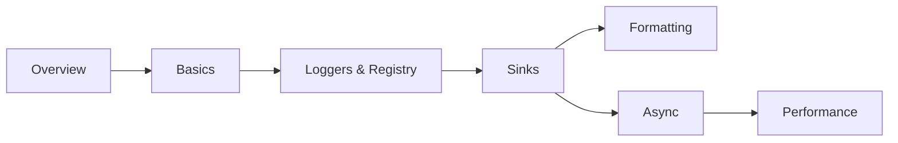

# spdlog Documentation Set Implementation Plan

> **For agentic workers:** REQUIRED SUB-SKILL: Use superpowers:subagent-driven-development (recommended) or superpowers:executing-plans to implement this plan task-by-task. Steps use checkbox (`- [ ]`) syntax for tracking.

**Goal:** Add a comprehensive, boost-style documentation set for `spdlog` at `docs/programming/spdlog/` (27 topic pages + overview), wired into the autogenerated `programming` sidebar.

**Architecture:** Task 1 creates the whole skeleton — folder, all `_category_.json` files, `readme.md`, and every topic `.md` as a valid stub (frontmatter + H1 + one framing sentence). Every later task fleshes out exactly one numbered subfolder. This ordering means `npm run build` (with `onBrokenLinks: "throw"`) passes after *every* task, because all link targets exist from Task 1 onward.

**Tech Stack:** Docusaurus 3.9 Markdown (MDX), Docusaurus admonitions, Mermaid (`@docusaurus/theme-mermaid`), Prism code fences, `<Icon icon="lucide:..." inline />` from the site's swizzled Icon component.

## Global Constraints

These apply to **every** page this plan creates. They are always in force and are not restated per task.

- **Folder position:** `docs/programming/spdlog/_category_.json` gets `"position": 7` (existing siblings: `cpp`=2, `python`=3, `cmake`=4, `boost`=5; `nlohmann-json`=6 is claimed by the parallel nlohmann/json plan — keep 7 regardless of whether that plan has run). Label is exactly `"spdlog"`.
- **JSON files are tab-indented** — every existing `_category_.json` in this repo uses a literal tab. Match it. (Biome's 2-space setting targets JS/TS; do not reformat these files.)
- **Subfolder `_category_.json` scheme** (copied from `docs/programming/cmake/*/`): folder `NN-name` gets `"label": "<NN+1>. <Human name>"` and `"position": <NN+2>`. So `00-overview` → label `"1. Overview"`, position `2`.
- **`readme.md` frontmatter** has `title`, `sidebar_label: Overview`, `sidebar_position: 1`, `tags` — **no `id`** (matches `boost/readme.md`, `cmake/readme.md`).
- **Topic page frontmatter** is exactly:
  ```md
  ---
  id: <kebab-case-id>
  title: <Human Title>
  sidebar_label: <short label>
  sidebar_position: <int, starts at 1 within its folder>
  tags: [c++, spdlog, <topic-tag>, <topic-tag>]
  ---
  ```
- **Tags** always start `c++, spdlog`, then 1-3 lowercase hyphenated topic tags.
- **Every topic page** opens with `# H1` matching `title`, then 1-2 prose paragraphs on *why this exists / what problem it solves* before any API detail, then `##` sections (`###` sparingly), and ends with a `## See also` list of 3-5 bullets in this exact shape:
  `- <Icon icon="lucide:xyz" inline /> [Link text](./relative-path.md) — one-line reason to go there.`
  Order: siblings first, then cross-folder, then `../readme.md` last.
- **Admonitions** — only these four, with these meanings: `:::info[...]` framing why a feature exists; `:::tip[...]` idiomatic usage / best practice; `:::danger[...]` UB and footguns; `:::note[...]` "which should I use", migration, version caveats.
- **Code fences:** ` ```cpp ` (or ` ```bash `, ` ```cmake `). Add `showLineNumbers` to any snippet longer than ~5 lines. Add `title="filename.cpp"` when the snippet is a real standalone file. Snippets must be conceptually compilable — correct `#include "spdlog/spdlog.h"` / `#include "spdlog/sinks/...h"`, no hand-waved syntax.
- **No `json` fences are needed in this plan.** Do not touch `prism.additionalLanguages`.
- **Voice:** precise, technical, conversational but not casual, willing to state opinions ("prefer X unless Y"). Every "how" paired with a "why" or a "when".
- **Comparison tables** (`| Feature | Option A | Option B |`) are mandatory wherever a page's job is to help the reader choose.
- **Never** add a `Co-Authored-By` trailer or "Generated with Claude Code" line to commits (`CLAUDE.md`). Commit messages are one line, `<type>: <what>`.
- **Verification gate for every task:** `npm run build` must exit 0. That is this repo's only correctness gate — it validates internal links, MDX syntax, and admonition syntax.

---

## File Structure

```
docs/programming/spdlog/
├── _category_.json                   label "spdlog", position 7
├── readme.md                         landing page: sections table, reading paths, quick reference
├── 00-overview/                      what it is, install, philosophy, alternatives
├── 01-basics/                        quick start, levels, formatting
├── 02-loggers-and-registry/          creating loggers, registry, lifecycle, multi-sink
├── 03-sinks/                         the sink interface and every built-in sink family
├── 04-formatting-and-patterns/       pattern flags, custom formatters, source location
├── 05-async-logging/                 thread pool, overflow policy, trade-offs
└── 06-performance-and-configuration/ compile-time level, backtrace, flush, globals
```

No sidebar edit is needed — `sidebars.js` autogenerates from `dirName: "programming"`.

---

### Task 1: Skeleton — folders, categories, stubs, readme

Creates every file the rest of the plan will fill in, so that all cross-links resolve from here on.

**Files:**
- Create: `docs/programming/spdlog/_category_.json`
- Create: `docs/programming/spdlog/readme.md`
- Create: `docs/programming/spdlog/{00-overview,01-basics,02-loggers-and-registry,03-sinks,04-formatting-and-patterns,05-async-logging,06-performance-and-configuration}/_category_.json`
- Create: 27 stub `.md` files (listed below)

**Interfaces:**
- Consumes: nothing.
- Produces: the exact file paths and frontmatter `id`/`title`/`sidebar_position` values that Tasks 2-8 fill in, and that every `See also` link in this plan targets.

- [ ] **Step 1: Create the folder `_category_.json` (tab-indented)**

`docs/programming/spdlog/_category_.json`:
```json
{
	"label": "spdlog",
	"position": 7,
	"link": {
		"type": "generated-index"
	}
}
```

- [ ] **Step 2: Create the seven subfolder `_category_.json` files (tab-indented)**

`00-overview/_category_.json`:
```json
{
	"label": "1. Overview",
	"position": 2,
	"link": {
		"type": "generated-index"
	}
}
```
Same shape for the rest, changing only label and position:
- `01-basics/` → `"label": "2. Basics"`, `"position": 3`
- `02-loggers-and-registry/` → `"label": "3. Loggers and registry"`, `"position": 4`
- `03-sinks/` → `"label": "4. Sinks"`, `"position": 5`
- `04-formatting-and-patterns/` → `"label": "5. Formatting and patterns"`, `"position": 6`
- `05-async-logging/` → `"label": "6. Async logging"`, `"position": 7`
- `06-performance-and-configuration/` → `"label": "7. Performance and configuration"`, `"position": 8`

- [ ] **Step 3: Create the 27 topic stubs**

Each stub is frontmatter + H1 + exactly one sentence of framing prose. No `## See also` yet (Tasks 2-8 write the real body). Exact stub shape:

```md
---
id: what-is-spdlog
title: What is spdlog?
sidebar_label: What is spdlog
sidebar_position: 1
tags: [c++, spdlog, overview, introduction]
---

# What is spdlog?

A very fast, header-only-by-default C++ logging library built on fmt.
```

Create all 27 with exactly these paths, ids, titles, sidebar labels, positions and tags:

**`00-overview/`**
| file | id | title | sidebar_label | pos | tags after `c++, spdlog` |
|---|---|---|---|---|---|
| `what-is-spdlog.md` | `what-is-spdlog` | What is spdlog? | What is spdlog | 1 | `overview, introduction` |
| `installation-and-integration.md` | `installation-and-integration` | Installation and integration | Installation | 2 | `install, cmake, build` |
| `design-philosophy.md` | `design-philosophy` | Design philosophy | Design philosophy | 3 | `design, philosophy, architecture` |
| `comparison-with-alternatives.md` | `comparison-with-alternatives` | Comparison with alternatives | Alternatives | 4 | `comparison, glog, boost-log` |

**`01-basics/`**
| file | id | title | sidebar_label | pos | tags after `c++, spdlog` |
|---|---|---|---|---|---|
| `quick-start.md` | `quick-start` | Quick start | Quick start | 1 | `basics, getting-started` |
| `log-levels.md` | `log-levels` | Log levels | Log levels | 2 | `basics, levels, filtering` |
| `basic-formatting.md` | `basic-formatting` | Basic formatting | Basic formatting | 3 | `basics, formatting, fmt` |

**`02-loggers-and-registry/`**
| file | id | title | sidebar_label | pos | tags after `c++, spdlog` |
|---|---|---|---|---|---|
| `creating-loggers.md` | `creating-loggers` | Creating loggers | Creating loggers | 1 | `loggers, factory` |
| `the-registry.md` | `the-registry` | The registry | The registry | 2 | `loggers, registry, global` |
| `logger-lifecycle.md` | `logger-lifecycle` | Logger lifecycle | Lifecycle | 3 | `loggers, lifetime, shutdown` |
| `multi-sink-loggers.md` | `multi-sink-loggers` | Multi-sink loggers | Multi-sink | 4 | `loggers, sinks, fan-out` |

**`03-sinks/`**
| file | id | title | sidebar_label | pos | tags after `c++, spdlog` |
|---|---|---|---|---|---|
| `sink-overview.md` | `sink-overview` | Sink overview | Sink overview | 1 | `sinks, architecture` |
| `console-sinks.md` | `console-sinks` | Console sinks | Console sinks | 2 | `sinks, console, color` |
| `file-sinks.md` | `file-sinks` | File sinks | File sinks | 3 | `sinks, files` |
| `rotating-and-daily-sinks.md` | `rotating-and-daily-sinks` | Rotating and daily sinks | Rotating and daily | 4 | `sinks, rotation, files` |
| `syslog-and-platform-sinks.md` | `syslog-and-platform-sinks` | Syslog and platform sinks | Platform sinks | 5 | `sinks, syslog, platform` |
| `custom-sinks.md` | `custom-sinks` | Custom sinks | Custom sinks | 6 | `sinks, custom, thread-safety` |

**`04-formatting-and-patterns/`**
| file | id | title | sidebar_label | pos | tags after `c++, spdlog` |
|---|---|---|---|---|---|
| `pattern-flags.md` | `pattern-flags` | Pattern flags | Pattern flags | 1 | `formatting, patterns` |
| `custom-formatters.md` | `custom-formatters` | Custom formatters | Custom formatters | 2 | `formatting, custom-flag` |
| `source-location-and-structured-logging.md` | `source-location-and-structured-logging` | Source location and structured logging | Source location | 3 | `formatting, macros, structured` |

**`05-async-logging/`**
| file | id | title | sidebar_label | pos | tags after `c++, spdlog` |
|---|---|---|---|---|---|
| `thread-pool-and-async-logger.md` | `thread-pool-and-async-logger` | Thread pool and async logger | Thread pool | 1 | `async, thread-pool` |
| `overflow-policies.md` | `overflow-policies` | Overflow policies | Overflow policies | 2 | `async, backpressure` |
| `async-vs-sync-tradeoffs.md` | `async-vs-sync-tradeoffs` | Async vs sync trade-offs | Async vs sync | 3 | `async, performance, latency` |

**`06-performance-and-configuration/`**
| file | id | title | sidebar_label | pos | tags after `c++, spdlog` |
|---|---|---|---|---|---|
| `compile-time-log-level.md` | `compile-time-log-level` | Compile-time log level | Compile-time level | 1 | `performance, macros, build` |
| `backtrace-and-crash-dump.md` | `backtrace-and-crash-dump` | Backtrace and crash dump | Backtrace | 2 | `diagnostics, backtrace` |
| `flush-policies.md` | `flush-policies` | Flush policies | Flush policies | 3 | `durability, flush` |
| `global-settings-and-best-practices.md` | `global-settings-and-best-practices` | Global settings and best practices | Best practices | 4 | `configuration, best-practices` |

- [ ] **Step 4: Write the full `readme.md`**

This is the real page, not a stub — every link target now exists. Structure copied from `docs/programming/cmake/readme.md`:

````md
---
title: Overview of spdlog
sidebar_label: Overview
sidebar_position: 1
tags: [c++, spdlog]
---

# spdlog Knowledge Base

<1-2 paragraphs: a very fast C++ logging library, header-only by default, built on fmt;
why it displaced glog/log4cplus as the default choice for new C++ projects — one include,
fmt-style formatting, throughput measured in millions of lines per second.>

:::info[How this is organised]
<Explain the progression: Overview → Basics gets you logging in five minutes; Loggers and
Sinks are the architecture you configure once per application; Formatting, Async, and
Performance are the tuning layers you add when the defaults stop fitting.>
:::

## Sections

|   | Section | What it covers |
|---|---------|----------------|
| <Icon icon="lucide:book-open" inline /> | [Overview](./00-overview/what-is-spdlog.md) | What it is, installing it, the sink architecture, how it compares to glog/Boost.Log |
| <Icon icon="lucide:play" inline /> | [Basics](./01-basics/quick-start.md) | The default logger, log levels, fmt-style formatting |
| <Icon icon="lucide:list-tree" inline /> | [Loggers & Registry](./02-loggers-and-registry/creating-loggers.md) | Creating loggers, the global registry, lifetime, multi-sink loggers |
| <Icon icon="lucide:plug" inline /> | [Sinks](./03-sinks/sink-overview.md) | Console, file, rotating, daily, syslog, and writing your own |
| <Icon icon="lucide:type" inline /> | [Formatting & Patterns](./04-formatting-and-patterns/pattern-flags.md) | Pattern flags, custom flag formatters, source location |
| <Icon icon="lucide:waypoints" inline /> | [Async Logging](./05-async-logging/thread-pool-and-async-logger.md) | The thread pool, overflow policies, when async pays off |
| <Icon icon="lucide:gauge" inline /> | [Performance & Configuration](./06-performance-and-configuration/compile-time-log-level.md) | Compile-time levels, backtrace, flush policies, global setup |

## Suggested reading paths



- <Icon icon="lucide:rocket" inline /> **Just want logs in my app:** [Quick start](./01-basics/quick-start.md) → [Log levels](./01-basics/log-levels.md) → [Console sinks](./03-sinks/console-sinks.md).
- <Icon icon="lucide:folder-cog" inline /> **Setting up logging for a real service:** [Creating loggers](./02-loggers-and-registry/creating-loggers.md) → [Multi-sink loggers](./02-loggers-and-registry/multi-sink-loggers.md) → [Rotating and daily sinks](./03-sinks/rotating-and-daily-sinks.md) → [Flush policies](./06-performance-and-configuration/flush-policies.md).
- <Icon icon="lucide:gauge" inline /> **Logging is showing up in the profile:** [Compile-time log level](./06-performance-and-configuration/compile-time-log-level.md) → [Async vs sync](./05-async-logging/async-vs-sync-tradeoffs.md) → [Overflow policies](./05-async-logging/overflow-policies.md).

## Quick reference

```cpp showLineNumbers title="the 90% of the API"
#include "spdlog/spdlog.h"
#include "spdlog/sinks/rotating_file_sink.h"

spdlog::info("plain message");
spdlog::warn("formatted: {} of {}", done, total);      // fmt syntax

auto file = spdlog::rotating_logger_mt(
    "app", "logs/app.log", 1024 * 1024 * 5, 3);        // 5 MB x 3 files
file->set_level(spdlog::level::debug);
file->set_pattern("[%Y-%m-%d %H:%M:%S.%e] [%n] [%l] %v");
file->flush_on(spdlog::level::err);

spdlog::set_default_logger(file);                      // spdlog::info now goes here
spdlog::shutdown();                                    // at exit
```

| Task | Call |
|---|---|
| Log at a level | `spdlog::trace/debug/info/warn/error/critical(...)` |
| Named console logger | `spdlog::stdout_color_mt("name")` |
| Named file logger | `spdlog::basic_logger_mt("name", "path.log")` |
| Fetch by name | `spdlog::get("name")` |
| Runtime level | `logger->set_level(spdlog::level::debug)` |
| Compile-time level | `-DSPDLOG_ACTIVE_LEVEL=SPDLOG_LEVEL_DEBUG` |
| Pattern | `logger->set_pattern("%+")` |
| Flush | `logger->flush()` / `flush_on(level)` |
````

- [ ] **Step 5: Verify the build passes**

Run: `npm run build`
Expected: exits 0, no `Docusaurus found broken links` error. A new sidebar section "spdlog" is generated.

- [ ] **Step 6: Commit**

```bash
git add docs/programming/spdlog
git commit -m "docs: scaffold spdlog doc set"
```

---

### Task 2: 00-overview

**Files:**
- Modify: `docs/programming/spdlog/00-overview/what-is-spdlog.md`
- Modify: `docs/programming/spdlog/00-overview/installation-and-integration.md`
- Modify: `docs/programming/spdlog/00-overview/design-philosophy.md`
- Modify: `docs/programming/spdlog/00-overview/comparison-with-alternatives.md`

**Interfaces:**
- Consumes: the stubs and frontmatter created in Task 1.
- Produces: `./00-overview/*.md` link targets used by `readme.md` and later folders' `See also` blocks.

- [ ] **Step 1: Write `what-is-spdlog.md`**

Keep the Task 1 frontmatter unchanged. Body sections:
- Opening prose: what logging in C++ looked like before (iostream-based, slow, macro-heavy); what spdlog optimised for — speed and a five-minute setup.
- `## The shape of the library` — one include for the default logger; loggers own sinks; sinks own formatters. Forward-link `./design-philosophy.md`.
- `## A first taste` — a `cpp showLineNumbers title="hello_log.cpp"` fence: include `spdlog/spdlog.h`, log at three levels with `{}` formatting, set a pattern.
- `## What you get out of the box` — bullet list: console with color, rotating/daily files, syslog, async mode, backtrace, compile-time level filtering.
- `## What it is not` — no log shipping, no structured/JSON output built in, no configuration file format; `:::note[...]` pointing at `../04-formatting-and-patterns/source-location-and-structured-logging.md` for the structured-logging workaround.
- `## See also` → `./installation-and-integration.md`, `./design-philosophy.md`, `../01-basics/quick-start.md`, `../readme.md`.

- [ ] **Step 2: Write `installation-and-integration.md`**

Body sections:
- Opening prose: the header-only default is what makes spdlog easy to adopt and what makes large projects' compile times worse — the compiled mode exists for exactly that reason.
- `## Header-only` — copy `include/`, `#include "spdlog/spdlog.h"`, no build step.
- `## Compiled mode` — `SPDLOG_COMPILED_LIB`, the `spdlog::spdlog` CMake target vs `spdlog::spdlog_header_only`; what it buys (compile time) and what it costs (a build dependency, ABI coupling).
- `## CMake: find_package` — a `cmake showLineNumbers title="CMakeLists.txt"` fence with `find_package(spdlog REQUIRED)` + `target_link_libraries(app PRIVATE spdlog::spdlog)`.
- `## CMake: FetchContent` — a `cmake showLineNumbers` fence; cross-link `../../cmake/03-dependencies/fetchcontent.md`.
- `## vcpkg and Conan` — one `bash` fence each.
- `## The bundled fmt` — spdlog vendors fmt by default; `SPDLOG_FMT_EXTERNAL` to use your own; `:::danger[Mixing a vendored fmt and an external fmt in one binary causes ODR violations]`.
- `## Which mode should I use?` — comparison table `| | Header-only | Compiled lib |` on compile time, link step, ABI, distribution.
- `## See also` → `./what-is-spdlog.md`, `../01-basics/quick-start.md`, `../../cmake/03-dependencies/find-package.md`, `../../cmake/03-dependencies/fetchcontent.md`, `../readme.md`.

- [ ] **Step 3: Write `design-philosophy.md`**

Body sections:
- Opening prose: three decisions explain almost every API in spdlog — fmt for formatting, sinks as the extension point, and "do the work off the caller's thread if you ask for it".
- `## Logger → sinks fan-out` — mandatory `mermaid flowchart`: `log call → logger (level filter) → [sink A, sink B, sink C] → formatter → output`.
- `## Built on fmt` — why compile-time-parsed format strings beat `printf` and iostreams for both safety and speed; link `../01-basics/basic-formatting.md`.
- `## Speed-first defaults` — no allocations in the common path, level check before formatting, `_mt` vs `_st` variants; table `| Suffix | Thread safety | Cost |`.
- `## Extension points` — sinks, formatters, custom flag formatters; link `../03-sinks/custom-sinks.md` and `../04-formatting-and-patterns/custom-formatters.md`.
- `## The cost` — header-only compile times, the vendored fmt, a global registry that is convenient and also global state; `:::note[Global state is a design choice, not an accident]` linking `../02-loggers-and-registry/the-registry.md`.
- `## See also` → `./what-is-spdlog.md`, `../03-sinks/sink-overview.md`, `../05-async-logging/thread-pool-and-async-logger.md`, `../readme.md`.

- [ ] **Step 4: Write `comparison-with-alternatives.md`**

Body sections:
- Opening prose: the alternatives differ mostly in how much machinery they impose before the first log line.
- `## The field` — a paragraph each on glog, Boost.Log, log4cplus, and hand-rolled `std::print`-style logging.
- `## Comparison table` — mandatory:
  `| | spdlog | glog | Boost.Log | log4cplus |` with rows for throughput, setup effort, formatting syntax, config file support, dependency weight, async support, C++ standard.
- `## Choosing` — a `mermaid flowchart`: need runtime config files and hierarchies? → log4cplus/Boost.Log; already deep in Boost? → Boost.Log; want speed and a five-line setup? → spdlog.
- `## When spdlog is the wrong tool` — you need a configuration DSL, hierarchical logger inheritance, or first-class structured/JSON events. `:::note[...]` linking `../04-formatting-and-patterns/source-location-and-structured-logging.md`.
- Before linking into `boost/`, confirm the target exists: run `ls docs/programming/boost/15-diagnostics-and-testing/`. Link `../../boost/15-diagnostics-and-testing/boost-log.md` if present, otherwise omit the Boost cross-link.
- `## See also` → `./design-philosophy.md`, `./what-is-spdlog.md`, `../06-performance-and-configuration/global-settings-and-best-practices.md`, `../readme.md`.

- [ ] **Step 5: Verify the build passes**

Run: `npm run build`
Expected: exits 0. If it reports `Docusaurus found broken links`, the failing link is printed with its source page — fix the path and re-run.

- [ ] **Step 6: Commit**

```bash
git add docs/programming/spdlog/00-overview
git commit -m "docs: add spdlog overview section"
```

---

### Task 3: 01-basics

**Files:**
- Modify: `docs/programming/spdlog/01-basics/quick-start.md`
- Modify: `docs/programming/spdlog/01-basics/log-levels.md`
- Modify: `docs/programming/spdlog/01-basics/basic-formatting.md`

**Interfaces:**
- Consumes: `../00-overview/*.md` (Task 2) as `See also` targets.
- Produces: `./01-basics/*.md` targets referenced by `readme.md` and Tasks 4-8.

- [ ] **Step 1: Write `quick-start.md`**

Body sections:
- Opening prose: the default logger exists so that adding logging to a program is one include and one call — everything else in these docs is about outgrowing it.
- `## The default logger` — `spdlog::info/warn/error(...)` free functions; where they write (stdout, colored) and at what level (info).
- `## A complete first program` — `cpp showLineNumbers title="main.cpp"` fence: include, three log calls with arguments, `spdlog::set_level`, `spdlog::set_pattern`.
- `## Naming your own logger` — `auto log = spdlog::stdout_color_mt("app");` then `log->info(...)`; why a named logger beats the default one as soon as you have more than one component. Link `../02-loggers-and-registry/creating-loggers.md`.
- `## Logging to a file in three lines` — `spdlog::basic_logger_mt("file", "logs/app.log")`; link `../03-sinks/file-sinks.md`.
- `## Shutting down` — `spdlog::shutdown()` and why it matters with async logging; link `../02-loggers-and-registry/logger-lifecycle.md`.
- `## See also` → `./log-levels.md`, `./basic-formatting.md`, `../02-loggers-and-registry/creating-loggers.md`, `../readme.md`.

- [ ] **Step 2: Write `log-levels.md`**

Body sections:
- Opening prose: levels are two filters, not one — a runtime one per logger/sink and a compile-time one that deletes the call entirely.
- `## The six levels` — table `| Level | enum | Intended for |` for `trace`, `debug`, `info`, `warn`, `err`, `critical` (plus `off`).
- `## Runtime filtering` — `logger->set_level(...)`, `spdlog::set_level(...)` for all registered loggers, and per-sink levels; `:::danger[A message must pass both the logger level and the sink level]` with a `cpp` fence showing a message silently dropped by a sink level.
- `## Compile-time filtering` — `SPDLOG_ACTIVE_LEVEL` and the `SPDLOG_TRACE`/`SPDLOG_DEBUG` macros; a `cmake` fence setting the define. Link `../06-performance-and-configuration/compile-time-log-level.md`.
- `## Level from environment` — `spdlog::cfg::load_env_levels()` and `SPDLOG_LEVEL=info,app=debug`; `:::tip[Env-var levels are the cheapest runtime config you'll ever add]`.
- `## Which mechanism when` — comparison table `| | Runtime level | Sink level | Compile-time macro |` on cost when disabled, granularity, and changeability.
- `## See also` → `./quick-start.md`, `../06-performance-and-configuration/compile-time-log-level.md`, `../02-loggers-and-registry/multi-sink-loggers.md`, `../readme.md`.

- [ ] **Step 3: Write `basic-formatting.md`**

Body sections:
- Opening prose: spdlog's format strings are fmt's format strings — the same `{}` mini-language, with the same compile-time-checkable syntax.
- `## Replacement fields` — `{}`, `{0}`, `{:>8}`, `{:.3f}` in log calls; a `cpp showLineNumbers` fence.
- `## Why not printf or streams` — table `| | printf | iostreams | spdlog/fmt |` on type safety, extensibility, throughput, translation-friendliness.
- `## Formatting your own types` — `fmt::formatter<T>` specialization, or `operator<<` via `spdlog/fmt/ostr.h`; a `cpp showLineNumbers title="point_formatter.hpp"` fence with a small `formatter<Point>`.
- `## Argument evaluation` — arguments are evaluated even when the level is disabled (unless you use the `SPDLOG_*` macros); `:::danger[An expensive argument still costs you at a disabled level]` linking `../06-performance-and-configuration/compile-time-log-level.md`.
- `## Escaping braces` — `{{` and `}}`; `:::note[A user-supplied string used as a format string is a bug]` — pass it as an argument, `spdlog::info("{}", user)`.
- `## See also` → `./quick-start.md`, `../04-formatting-and-patterns/pattern-flags.md`, `../00-overview/design-philosophy.md`, `../readme.md`.

- [ ] **Step 4: Verify the build passes**

Run: `npm run build`
Expected: exits 0, no broken-link error.

- [ ] **Step 5: Commit**

```bash
git add docs/programming/spdlog/01-basics
git commit -m "docs: add spdlog basics section"
```

---

### Task 4: 02-loggers-and-registry

**Files:**
- Modify: `docs/programming/spdlog/02-loggers-and-registry/creating-loggers.md`
- Modify: `docs/programming/spdlog/02-loggers-and-registry/the-registry.md`
- Modify: `docs/programming/spdlog/02-loggers-and-registry/logger-lifecycle.md`
- Modify: `docs/programming/spdlog/02-loggers-and-registry/multi-sink-loggers.md`

**Interfaces:**
- Consumes: `../00-overview/*.md`, `../01-basics/*.md` as link targets.
- Produces: `./02-loggers-and-registry/*.md` targets used by Tasks 5-8 and `readme.md`.

- [ ] **Step 1: Write `creating-loggers.md`**

Body sections:
- Opening prose: two ways to make a logger — the factory helpers that also register it, and explicit construction when you want to own the sinks.
- `## Factory helpers` — `stdout_color_mt`, `basic_logger_mt`, `rotating_logger_mt`, `daily_logger_mt`; table `| Factory | Sink created | Registered |`.
- `## _mt vs _st` — mutex-protected vs single-threaded sinks; `:::danger[Using an _st logger from two threads is a data race]`.
- `## Explicit construction` — a `cpp showLineNumbers` fence building a `std::shared_ptr<spdlog::sinks::stdout_color_sink_mt>` and passing it to `std::make_shared<spdlog::logger>("name", sink)`, then `spdlog::register_logger(...)`.
- `## Duplicate names` — the factories throw `spdlog_ex` on an existing name; `spdlog::drop(name)` first, or use explicit construction to keep it unregistered. Link `./the-registry.md`.
- `## Per-logger configuration` — `set_level`, `set_pattern`, `flush_on`; note they apply to all of the logger's sinks unless the sink has its own. Link `./multi-sink-loggers.md`.
- `## See also` → `./the-registry.md`, `./multi-sink-loggers.md`, `../03-sinks/sink-overview.md`, `../01-basics/quick-start.md`, `../readme.md`.

- [ ] **Step 2: Write `the-registry.md`**

Body sections:
- Opening prose: the registry is a global name→logger map; it is what makes `spdlog::get("db")` work from anywhere and what makes shutdown order matter.
- `## What lives in it` — loggers created by factories, plus anything you `register_logger`; the default logger.
- `## Looking up` — `spdlog::get("name")` returning `nullptr` when absent; `:::danger[spdlog::get returns nullptr, it does not throw — check it]`.
- `## The default logger` — `spdlog::default_logger()`, `set_default_logger()`, and what happens to the old one; a `cpp showLineNumbers` fence swapping the default to a file logger.
- `## Global operations` — `spdlog::set_level`, `set_pattern`, `flush_on`, `apply_all`; note these only touch *registered* loggers. `:::note[An unregistered logger is invisible to every global setter]`.
- `## Automatic registration` — `spdlog::set_automatic_registration(false)` for library code; `:::tip[Libraries should not register loggers into the host application's registry]`.
- `## Dropping` — `drop(name)`, `drop_all()`, and their interaction with shared ownership. Link `./logger-lifecycle.md`.
- `## See also` → `./creating-loggers.md`, `./logger-lifecycle.md`, `../06-performance-and-configuration/global-settings-and-best-practices.md`, `../readme.md`.

- [ ] **Step 3: Write `logger-lifecycle.md`**

Body sections:
- Opening prose: loggers are `shared_ptr`-owned; the registry holds one reference, you hold others, and async logging adds a thread pool that must outlive both.
- `## Shared ownership` — `std::shared_ptr<spdlog::logger>`; caching the pointer in your class instead of calling `spdlog::get` on every log call; `:::tip[spdlog::get takes a lock — cache the shared_ptr]`.
- `## Sink sharing` — several loggers can share one sink instance, which is how you get one file written by many components; link `./multi-sink-loggers.md`.
- `## Shutdown` — `spdlog::shutdown()`: drops all registered loggers and joins the async thread pool; `:::danger[Logging after shutdown, or from a static destructor, is undefined]`.
- `## Static initialization order` — the classic trap of a file-scope logger in a library; the fix (function-local static, or an explicit init call).
- `## Lifetime with async loggers` — the thread pool must be alive when the async logger flushes; link `../05-async-logging/thread-pool-and-async-logger.md`.
- `## See also` → `./the-registry.md`, `./creating-loggers.md`, `../05-async-logging/thread-pool-and-async-logger.md`, `../readme.md`.

- [ ] **Step 4: Write `multi-sink-loggers.md`**

Body sections:
- Opening prose: one logger, several destinations — the standard shape for "everything to a file, warnings and up to the console".
- `## Constructing one` — a `cpp showLineNumbers title="multi_sink.cpp"` fence: a `stdout_color_sink_mt` and a `rotating_file_sink_mt` in a `std::vector<spdlog::sink_ptr>`, passed to the `logger(name, begin, end)` constructor.
- `## Per-sink levels` — `sink->set_level(spdlog::level::warn)` so the console stays quiet while the file gets everything; mandatory table `| | Logger level | Sink level |` on what each filters and the order they apply in.
- `## Per-sink patterns` — `sink->set_pattern(...)`: colored short pattern for console, full timestamped pattern for the file. Link `../04-formatting-and-patterns/pattern-flags.md`.
- `## The fan-out` — mandatory `mermaid flowchart`: one `logger` node fanning out to `console sink (warn+)`, `rotating file sink (debug+)`, `syslog sink (err+)`.
- `## Cost` — every enabled sink formats the message again unless it shares a formatter; `:::note[Sinks each run their own formatter — five sinks means five format passes]`.
- `## See also` → `./creating-loggers.md`, `../03-sinks/sink-overview.md`, `../04-formatting-and-patterns/pattern-flags.md`, `../readme.md`.

- [ ] **Step 5: Verify the build passes**

Run: `npm run build`
Expected: exits 0, no broken-link error.

- [ ] **Step 6: Commit**

```bash
git add docs/programming/spdlog/02-loggers-and-registry
git commit -m "docs: add spdlog loggers and registry section"
```

---

### Task 5: 03-sinks

**Files:**
- Modify: `docs/programming/spdlog/03-sinks/sink-overview.md`
- Modify: `docs/programming/spdlog/03-sinks/console-sinks.md`
- Modify: `docs/programming/spdlog/03-sinks/file-sinks.md`
- Modify: `docs/programming/spdlog/03-sinks/rotating-and-daily-sinks.md`
- Modify: `docs/programming/spdlog/03-sinks/syslog-and-platform-sinks.md`
- Modify: `docs/programming/spdlog/03-sinks/custom-sinks.md`

**Interfaces:**
- Consumes: `../02-loggers-and-registry/multi-sink-loggers.md` (Task 4) as the entry point for attaching sinks.
- Produces: `./03-sinks/*.md` targets used by Tasks 6-8 and `readme.md`.

- [ ] **Step 1: Write `sink-overview.md`**

Body sections:
- Opening prose: the split of responsibility — a logger decides *whether* to log, a sink decides *where* and *how*.
- `## The sink interface` — a `cpp showLineNumbers` fence with the virtuals: `log(const details::log_msg&)`, `flush()`, `set_pattern(const std::string&)`, `set_formatter(std::unique_ptr<formatter>)`.
- `## Decision diagram` — mandatory `mermaid flowchart` answering "which sink do I want": short-lived CLI → console; service writing to disk → rotating; one file per day → daily; system integration → syslog/event log; anything else → custom.
- `## The _mt / _st suffix` — the same sink in a mutex-guarded and an unguarded flavour; table `| | _st | _mt |` on locking cost and safe usage.
- `## Sinks are shareable` — one sink instance can back several loggers; that is how two components write to one file without interleaving corruption. Link `../02-loggers-and-registry/multi-sink-loggers.md`.
- `## Built-in sink families` — table `| Family | Header | Page |` linking each of `./console-sinks.md`, `./file-sinks.md`, `./rotating-and-daily-sinks.md`, `./syslog-and-platform-sinks.md`.
- `## See also` → `./console-sinks.md`, `./custom-sinks.md`, `../02-loggers-and-registry/multi-sink-loggers.md`, `../readme.md`.

- [ ] **Step 2: Write `console-sinks.md`**

Body sections:
- Opening prose: console output is the default because it's the one destination that always exists — the interesting parts are color and which stream you land on.
- `## stdout vs stderr` — `stdout_color_sink_mt`, `stderr_color_sink_mt`, and the non-color `stdout_sink_mt`/`stderr_sink_mt`; `:::tip[Log errors to stderr so pipelines can separate them]`.
- `## Color` — how color is applied per level, `sink->set_color(spdlog::level::info, sink->green)`, and the `%^`/`%$` pattern range that bounds the colored region. Link `../04-formatting-and-patterns/pattern-flags.md`.
- `## Color and redirection` — `:::danger[ANSI codes end up in your log file when stdout is redirected]` — use a non-color sink when the stream is not a TTY.
- `## Windows` — `wincolor_sink` and the console API vs ANSI; the UTF-8 code page caveat.
- `## Throughput` — console output is slow and serialized by the OS; `:::note[If console logging is in your hot path, move it to a file or async]` linking `../05-async-logging/async-vs-sync-tradeoffs.md`.
- `## See also` → `./sink-overview.md`, `./file-sinks.md`, `../04-formatting-and-patterns/pattern-flags.md`, `../readme.md`.

- [ ] **Step 3: Write `file-sinks.md`**

Body sections:
- Opening prose: the simplest durable destination, and the one whose failure modes (permissions, unbounded growth, buffering) bite in production.
- `## basic_file_sink` — a `cpp showLineNumbers` fence creating one directly and via `spdlog::basic_logger_mt`.
- `## Truncate vs append` — the `truncate` constructor flag; table `| truncate | Behaviour on restart |`.
- `## Directory creation` — spdlog creates missing directories for the log path; what it throws (`spdlog_ex`) when it can't.
- `## Buffering and durability` — writes are buffered; `:::danger[A crash loses everything not yet flushed]` linking `../06-performance-and-configuration/flush-policies.md`.
- `## Unbounded growth` — `:::note[basic_file_sink never rotates — use a rotating or daily sink for anything long-lived]` linking `./rotating-and-daily-sinks.md`.
- `## See also` → `./rotating-and-daily-sinks.md`, `./sink-overview.md`, `../06-performance-and-configuration/flush-policies.md`, `../readme.md`.

- [ ] **Step 4: Write `rotating-and-daily-sinks.md`**

Body sections:
- Opening prose: two different answers to "the log file cannot grow forever" — rotate by size, or start a new file each day.
- `## rotating_file_sink` — `rotating_file_sink_mt(base_filename, max_size, max_files)`; the renaming scheme (`app.log`, `app.1.log`, …) and what happens to the oldest file. A `cpp showLineNumbers` fence.
- `## daily_file_sink` — `daily_file_sink_mt(base_filename, hour, minute)`; the date-stamped filename; the `max_files` retention parameter.
- `## Comparison table` — mandatory: `| | rotating | daily |` on disk-usage bound, filename predictability, behaviour for a process that runs for minutes vs months, and interaction with external logrotate.
- `## Rotation on open` — the `rotate_on_open` flag for rotating sinks; when a fresh file per run is what you want.
- `## Interaction with logrotate` — `:::danger[Do not point external logrotate at a file spdlog holds open — the writes go to the unlinked inode]`.
- `## Choosing` — `:::note[Bound by disk quota → rotating. Bound by "one file per day for ops" → daily.]`
- `## See also` → `./file-sinks.md`, `./sink-overview.md`, `../06-performance-and-configuration/flush-policies.md`, `../readme.md`.

- [ ] **Step 5: Write `syslog-and-platform-sinks.md`**

Body sections:
- Opening prose: when the platform already owns log collection, writing your own file is the wrong answer.
- `## syslog_sink` — `spdlog/sinks/syslog_sink.h`, the ident/facility parameters, and the level→syslog-priority mapping table.
- `## systemd journal` — `systemd_sink` and how it differs from syslog (structured fields, no timestamp formatting on your side).
- `## Windows event log and debugger` — `win_eventlog_sink`, `msvc_sink` (`OutputDebugString`); when each is useful.
- `## Android` — `android_sink` mapping to `__android_log_write`, and the tag parameter.
- `## Portability` — mandatory table `| Sink | Platform | Header |`; `:::danger[These headers are platform-specific — including them unconditionally breaks cross-platform builds]`.
- `## See also` → `./sink-overview.md`, `./custom-sinks.md`, `./console-sinks.md`, `../readme.md`.

- [ ] **Step 6: Write `custom-sinks.md`**

Body sections:
- Opening prose: a custom sink is the supported way to send logs anywhere spdlog doesn't already reach — an in-memory ring, a socket, a test double.
- `## base_sink<Mutex>` — derive from `spdlog::sinks::base_sink<std::mutex>` and implement `sink_it_(const details::log_msg&)` and `flush_()`; a `cpp showLineNumbers title="ring_sink.hpp"` fence implementing a fixed-size in-memory sink.
- `## Why base_sink and not sink` — `base_sink` handles locking and the formatter for you; `:::danger[Deriving from sink directly means you own all thread-safety yourself]`.
- `## Formatting inside a sink` — `formatter_->format(msg, buffer)` then writing `buffer.data()`/`buffer.size()`; `log_msg::payload` is a `string_view` into a buffer that does not outlive the call. `:::danger[Storing msg.payload without copying dangles]`.
- `## The mutex parameter` — `std::mutex` for `_mt`, `spdlog::details::null_mutex` for `_st`; a table `| Mutex type | Use |`.
- `## Testing with a custom sink` — `:::tip[A vector-backed sink is the cleanest way to assert on log output in unit tests]`.
- `## Registering it` — passing the sink to a logger, and the `_mt`/`_st` factory pattern if you want a matching helper.
- `## See also` → `./sink-overview.md`, `../02-loggers-and-registry/multi-sink-loggers.md`, `../04-formatting-and-patterns/custom-formatters.md`, `../readme.md`.

- [ ] **Step 7: Verify the build passes**

Run: `npm run build`
Expected: exits 0, no broken-link error.

- [ ] **Step 8: Commit**

```bash
git add docs/programming/spdlog/03-sinks
git commit -m "docs: add spdlog sinks section"
```

---

### Task 6: 04-formatting-and-patterns

**Files:**
- Modify: `docs/programming/spdlog/04-formatting-and-patterns/pattern-flags.md`
- Modify: `docs/programming/spdlog/04-formatting-and-patterns/custom-formatters.md`
- Modify: `docs/programming/spdlog/04-formatting-and-patterns/source-location-and-structured-logging.md`

**Interfaces:**
- Consumes: `../01-basics/basic-formatting.md`, `../03-sinks/sink-overview.md` as link targets.
- Produces: `./04-formatting-and-patterns/*.md` targets used by Tasks 7-8 and `readme.md`.

- [ ] **Step 1: Write `pattern-flags.md`**

Body sections:
- Opening prose: the pattern controls the *line around* your message — timestamp, level, logger name — and is set per logger or per sink, not per call.
- `## Setting a pattern` — `spdlog::set_pattern(...)` globally, `logger->set_pattern(...)`, `sink->set_pattern(...)`; the last one wins for that sink. Link `../02-loggers-and-registry/multi-sink-loggers.md`.
- `## The flag table` — mandatory reference table `| Flag | Meaning | Example output |` covering at least `%v`, `%n`, `%l`, `%L`, `%t`, `%P`, `%Y`, `%m`, `%d`, `%H`, `%M`, `%S`, `%e`, `%f`, `%F`, `%z`, `%+`, `%@`, `%s`, `%#`, `%!`.
- `## Color range` — `%^` and `%$` bounding the colored span; a `cpp` fence with a pattern that colors only the level.
- `## Padding and alignment` — `%-8l`, `%8n` style width specifiers on flags.
- `## Cost` — every flag is work per message; `:::note[%s/%# only carry a value if you use the SPDLOG_* macros]` linking `./source-location-and-structured-logging.md`.
- `## Recommended patterns` — a short list: a human-readable dev pattern, a machine-parseable production pattern, a minimal console pattern. `:::tip[...]` with the production one spelled out.
- `## See also` → `./custom-formatters.md`, `./source-location-and-structured-logging.md`, `../01-basics/basic-formatting.md`, `../readme.md`.

- [ ] **Step 2: Write `custom-formatters.md`**

Body sections:
- Opening prose: when no built-in flag carries the field you need — a request id, a thread name, a tenant — you add your own flag rather than stuffing it into every message.
- `## custom_flag_formatter` — a `cpp showLineNumbers title="thread_name_flag.hpp"` fence deriving from `spdlog::custom_flag_formatter`, implementing `format(const details::log_msg&, const std::tm&, memory_buf_t&)` and `clone()`.
- `## Wiring it up` — a `cpp showLineNumbers` fence: `auto f = std::make_unique<spdlog::pattern_formatter>(); f->add_flag<my_flag>('*').set_pattern("[%*] %v"); spdlog::set_formatter(std::move(f));`.
- `## clone() is not optional` — `:::danger[Each sink clones the formatter; a clone() that drops state produces silently wrong output]`.
- `## Replacing the whole formatter` — implementing `spdlog::formatter` directly for a wire format; when that beats a pattern.
- `## Where formatters live` — per logger vs per sink, and the fact that a shared formatter is cloned per sink. Link `../03-sinks/sink-overview.md`.
- `## See also` → `./pattern-flags.md`, `../03-sinks/custom-sinks.md`, `./source-location-and-structured-logging.md`, `../readme.md`.

- [ ] **Step 3: Write `source-location-and-structured-logging.md`**

Body sections:
- Opening prose: file/line/function are free only if the call site captures them — which is why these are macros, and why spdlog has no built-in JSON output.
- `## The SPDLOG_* macros` — `SPDLOG_INFO(...)`, `SPDLOG_LOGGER_INFO(logger, ...)`, `SPDLOG_LOGGER_CALL(...)`; what they capture (`__FILE__`, `__LINE__`, `SPDLOG_FUNCTION`) and their interaction with `SPDLOG_ACTIVE_LEVEL`. Link `../06-performance-and-configuration/compile-time-log-level.md`.
- `## Function vs macro` — mandatory comparison table `| | spdlog::info(...) | SPDLOG_INFO(...) |` on source location, compile-time elision, argument evaluation when disabled.
- `## Printing the location` — the `%s`, `%#`, `%!`, `%@` pattern flags; a `cpp showLineNumbers` fence with pattern and resulting output.
- `## Structured logging` — spdlog logs lines, not events; the two practical approaches: (a) a key=value convention in the message with a fixed pattern, (b) a custom formatter emitting JSON. Show a small key=value helper in a `cpp` fence and link `./custom-formatters.md`.
- `## Correlation ids` — a custom flag reading a thread-local request id; link `./custom-formatters.md`.
- `## Honest limitation` — `:::note[If you need real structured events with typed fields, spdlog is a transport, not the answer — format JSON in a custom formatter and treat the message as one field]`.
- `## See also` → `./pattern-flags.md`, `./custom-formatters.md`, `../06-performance-and-configuration/compile-time-log-level.md`, `../readme.md`.

- [ ] **Step 4: Verify the build passes**

Run: `npm run build`
Expected: exits 0, no broken-link error.

- [ ] **Step 5: Commit**

```bash
git add docs/programming/spdlog/04-formatting-and-patterns
git commit -m "docs: add spdlog formatting and patterns section"
```

---

### Task 7: 05-async-logging

**Files:**
- Modify: `docs/programming/spdlog/05-async-logging/thread-pool-and-async-logger.md`
- Modify: `docs/programming/spdlog/05-async-logging/overflow-policies.md`
- Modify: `docs/programming/spdlog/05-async-logging/async-vs-sync-tradeoffs.md`

**Interfaces:**
- Consumes: `../02-loggers-and-registry/logger-lifecycle.md`, `../03-sinks/sink-overview.md` as link targets.
- Produces: `./05-async-logging/*.md` targets used by Task 8 and `readme.md`.

- [ ] **Step 1: Write `thread-pool-and-async-logger.md`**

Body sections:
- Opening prose: async logging moves formatting and I/O off the calling thread onto a pool — the calling thread only copies the message into a queue.
- `## The pipeline` — mandatory `mermaid flowchart`: `caller thread → async_logger → bounded queue → worker thread(s) → sinks → output`.
- `## Setting it up` — a `cpp showLineNumbers title="async_setup.cpp"` fence: `spdlog::init_thread_pool(8192, 1);` then `spdlog::create_async<spdlog::sinks::rotating_file_sink_mt>("app", "logs/app.log", max_size, max_files);`.
- `## Queue size and worker count` — what each parameter costs in memory (`queue_size × sizeof(async_msg)`), why more than one worker reorders messages: `:::danger[More than one worker thread means log lines can appear out of order]`.
- `## What gets copied` — the message payload is copied into the queue at call time, so arguments are formatted eagerly; `:::note[Async does not make expensive arguments free — it only moves the I/O]`.
- `## Shutdown` — `spdlog::shutdown()` drains and joins; `:::danger[Destroying the thread pool before the loggers that use it is undefined]` linking `../02-loggers-and-registry/logger-lifecycle.md`.
- `## create_async vs create_async_nb` — the blocking and non-blocking factory helpers; link `./overflow-policies.md`.
- `## See also` → `./overflow-policies.md`, `./async-vs-sync-tradeoffs.md`, `../02-loggers-and-registry/logger-lifecycle.md`, `../readme.md`.

- [ ] **Step 2: Write `overflow-policies.md`**

Body sections:
- Opening prose: the queue is bounded, so at some point the producer outruns the consumer — the policy decides which guarantee you give up, latency or completeness.
- `## The policies` — `async_overflow_policy::block` and `async_overflow_policy::overrun_oldest`; mandatory table `| Policy | On a full queue | You lose | Use when |`. A `:::note[...]` records that newer spdlog releases add `discard_new` — check the version you're on rather than assuming it exists.
- `## Setting the policy` — a `cpp showLineNumbers` fence constructing an `async_logger` explicitly with the policy argument, and the `create_async_nb` shortcut.
- `## block` — the calling thread stalls until space frees; `:::danger[block turns a slow disk into application latency — including in your request path]`.
- `## overrun_oldest` — the oldest queued message is dropped; `:::danger[Dropped messages are silent — the log looks complete and isn't]`.
- `## Sizing the queue instead` — the real fix is usually a bigger queue plus a faster sink; a short worked memory calculation for a given `queue_size`.
- `## Choosing` — `:::note[Audit/compliance logs → block. Diagnostic logs in a latency-sensitive service → overrun_oldest.]`
- `## See also` → `./thread-pool-and-async-logger.md`, `./async-vs-sync-tradeoffs.md`, `../06-performance-and-configuration/flush-policies.md`, `../readme.md`.

- [ ] **Step 3: Write `async-vs-sync-tradeoffs.md`**

Body sections:
- Opening prose: async is not strictly better — it trades tail latency and complexity for throughput, and it changes what "the log survived the crash" means.
- `## Comparison table` — mandatory: `| | Sync logger | Async logger |` with rows for caller-thread cost, throughput, message ordering, memory, crash durability, shutdown complexity, debuggability.
- `## When async wins` — high message rates, slow sinks (network, syslog, rotating file on a busy disk), latency-sensitive callers.
- `## When async loses` — low log volume, short-lived processes, anything where a message lost in a crash is unacceptable, tests that assert on log output.
- `## The crash case` — `:::danger[Messages sitting in the async queue are lost on abort — a sync logger with flush_on(err) is what you want for the last words before a crash]` linking `../06-performance-and-configuration/flush-policies.md` and `../06-performance-and-configuration/backtrace-and-crash-dump.md`.
- `## The middle ground` — a sync console/error logger alongside an async bulk logger; link `../02-loggers-and-registry/multi-sink-loggers.md`.
- `## Measuring before switching` — `:::tip[Measure the caller-thread cost of your existing logger first — with compile-time level filtering, most disabled logs already cost nothing]` linking `../06-performance-and-configuration/compile-time-log-level.md`.
- `## See also` → `./thread-pool-and-async-logger.md`, `./overflow-policies.md`, `../06-performance-and-configuration/compile-time-log-level.md`, `../readme.md`.

- [ ] **Step 4: Verify the build passes**

Run: `npm run build`
Expected: exits 0, no broken-link error.

- [ ] **Step 5: Commit**

```bash
git add docs/programming/spdlog/05-async-logging
git commit -m "docs: add spdlog async logging section"
```

---

### Task 8: 06-performance-and-configuration

**Files:**
- Modify: `docs/programming/spdlog/06-performance-and-configuration/compile-time-log-level.md`
- Modify: `docs/programming/spdlog/06-performance-and-configuration/backtrace-and-crash-dump.md`
- Modify: `docs/programming/spdlog/06-performance-and-configuration/flush-policies.md`
- Modify: `docs/programming/spdlog/06-performance-and-configuration/global-settings-and-best-practices.md`

**Interfaces:**
- Consumes: every earlier folder as `See also` targets.
- Produces: the final four pages referenced by `readme.md`'s Sections table.

- [ ] **Step 1: Write `compile-time-log-level.md`**

Body sections:
- Opening prose: a runtime level check is cheap but not free; a compile-time level deletes the call site entirely, arguments included.
- `## SPDLOG_ACTIVE_LEVEL` — the macro, its `SPDLOG_LEVEL_*` values, and the fact that it only affects the `SPDLOG_*` macros, not `spdlog::info(...)`. `:::danger[Setting SPDLOG_ACTIVE_LEVEL does nothing if you call spdlog::info() instead of SPDLOG_INFO()]`.
- `## Setting it in the build` — a `cmake showLineNumbers title="CMakeLists.txt"` fence with `target_compile_definitions(app PRIVATE SPDLOG_ACTIVE_LEVEL=SPDLOG_LEVEL_INFO)`, plus a per-configuration variant using a generator expression. Link `../../cmake/05-advanced/generator-expressions.md`.
- `## What "deleted" means` — the argument expressions are not evaluated and not emitted; a `cpp showLineNumbers` fence with an expensive argument that disappears.
- `## ODR hazard` — `:::danger[Different translation units compiled with different SPDLOG_ACTIVE_LEVEL values violate the ODR — set it project-wide]`.
- `## Runtime vs compile-time` — mandatory table `| | Runtime set_level | SPDLOG_ACTIVE_LEVEL |` on cost when disabled, changeability, argument evaluation, scope.
- `## Recommended setup` — `:::tip[Debug builds at SPDLOG_LEVEL_TRACE, release at SPDLOG_LEVEL_INFO, then use runtime levels for everything finer]`.
- `## See also` → `./global-settings-and-best-practices.md`, `../01-basics/log-levels.md`, `../04-formatting-and-patterns/source-location-and-structured-logging.md`, `../readme.md`.

- [ ] **Step 2: Write `backtrace-and-crash-dump.md`**

Body sections:
- Opening prose: the messages you want after a failure are the debug ones you were not writing — the backtrace ring buffer keeps them in memory and emits them only when something goes wrong.
- `## enable_backtrace` — `spdlog::enable_backtrace(32)` / `logger->enable_backtrace(n)`; messages below the active level are stored in a ring instead of being dropped.
- `## Dumping` — `spdlog::dump_backtrace()` on demand; `logger->dump_backtrace()`; a `cpp showLineNumbers title="backtrace_demo.cpp"` fence: enable, log many debug lines at info level, then dump inside an error handler.
- `## Cost` — the ring buffer copies every message even when the level is disabled at runtime; `:::danger[With backtrace enabled, a runtime-disabled debug log is no longer free]` linking `./compile-time-log-level.md`.
- `## Interaction with compile-time levels` — a message elided at compile time never reaches the ring; `:::note[Compile-time filtering wins over backtrace — keep SPDLOG_ACTIVE_LEVEL at trace if you rely on backtrace]`.
- `## Crash handlers` — logging from a signal handler is unsafe; what is realistic (set a flag, dump from a safe context); `:::danger[spdlog calls are not async-signal-safe — do not log from a signal handler]`.
- `## See also` → `./flush-policies.md`, `./compile-time-log-level.md`, `../05-async-logging/async-vs-sync-tradeoffs.md`, `../readme.md`.

- [ ] **Step 3: Write `flush-policies.md`**

Body sections:
- Opening prose: a log line that is in a buffer when the process dies never existed — flushing is the knob between durability and throughput.
- `## Manual flush` — `logger->flush()`, flushing every registered logger via `spdlog::apply_all`.
- `## flush_on(level)` — flush automatically at and above a level; a `cpp` fence with `flush_on(spdlog::level::err)`.
- `## Periodic flush` — `spdlog::flush_every(std::chrono::seconds(3))`; it starts a background thread; `:::danger[flush_every's worker interacts with static destruction — call spdlog::shutdown() before exit]` linking `../02-loggers-and-registry/logger-lifecycle.md`.
- `## Comparison table` — mandatory: `| Policy | Durability | Throughput cost | Use when |` for never/manual, `flush_on(err)`, `flush_every`, flush-every-message.
- `## Async and flush` — a flush drains the queue; `:::note[flush() on an async logger blocks until the worker has drained]` linking `../05-async-logging/thread-pool-and-async-logger.md`.
- `## Recommended default` — `:::tip[flush_on(err) plus flush_every(3s) is the setting most services should start with]`.
- `## See also` → `./global-settings-and-best-practices.md`, `../03-sinks/file-sinks.md`, `../05-async-logging/overflow-policies.md`, `../readme.md`.

- [ ] **Step 4: Write `global-settings-and-best-practices.md`**

Body sections:
- Opening prose: spdlog's globals make the five-minute setup possible and make the thousand-file codebase confusing — this page is the one place to decide your policy.
- `## The global setters` — table `| Call | Affects |` for `spdlog::set_level`, `set_pattern`, `flush_on`, `set_default_logger`, `set_error_handler`, `set_automatic_registration`, `apply_all`.
- `## A canonical init function` — a `cpp showLineNumbers title="logging_init.cpp"` fence: create a console sink and a rotating file sink, build one multi-sink logger, set pattern, level, `flush_on(err)`, `set_default_logger`, register a `set_error_handler`. This is the page's centerpiece.
- `## Error handling` — `spdlog::set_error_handler([](const std::string& msg){...})`; what spdlog does by default when a sink throws; `:::danger[An exception escaping your error handler terminates the process]`.
- `## Library code vs application code` — `:::note[A library should take a logger, not create one — or at minimum disable automatic registration]` linking `../02-loggers-and-registry/the-registry.md`.
- `## Pitfalls checklist` — bulleted, each linking to the page that covers it: `_st` sinks across threads, `spdlog::get` in a hot loop, logging after `shutdown()`, `SPDLOG_ACTIVE_LEVEL` mismatched across TUs, `overrun_oldest` dropping silently, ANSI codes in redirected output, external logrotate on an open file, expensive arguments at disabled levels.
- `## A production baseline` — a short numbered list: compile-time level per build type, one multi-sink logger, machine-parseable timestamped pattern, `flush_on(err)` + `flush_every(3s)`, async only if measured, `shutdown()` at exit.
- `## See also` → `./flush-policies.md`, `./compile-time-log-level.md`, `../02-loggers-and-registry/the-registry.md`, `../05-async-logging/async-vs-sync-tradeoffs.md`, `../readme.md`.

- [ ] **Step 5: Verify the whole doc set builds and lints**

Run: `npm run build`
Expected: exits 0, no broken-link error.

Run: `npm run lint`
Expected: exits 0. If Biome reports formatting on the new Markdown, run `npm run format`, then re-run `npm run lint`.

- [ ] **Step 6: Verify no `_category_.json` position collides**

Run: `for d in docs/programming/*/; do echo "$d $(grep '"position"' $d/_category_.json)"; done`
Expected: `cpp`=2, `python`=3, `cmake`=4, `boost`=5, `spdlog`=7, each appearing once (`nlohmann-json`=6 and `fmt`=8 appear only if those plans have also run).

- [ ] **Step 7: Commit**

```bash
git add docs/programming/spdlog/06-performance-and-configuration
git commit -m "docs: add spdlog performance and configuration section"
```

---

## Spec coverage check

| Spec requirement | Task |
|---|---|
| Folder at `docs/programming/spdlog/`, position 7, label `"spdlog"` | 1 |
| `readme.md` with framing, `:::info[How this is organised]`, Sections table, reading paths + mermaid, Quick reference | 1 |
| Numbered subfolders each with `_category_.json` (label/position/generated-index) | 1 |
| Frontmatter shape, `id` omitted on readme, tag rules, `sidebar_position` from 1 | 1 (stubs carry final frontmatter) |
| Page structure: H1, framing prose, `##` sections, `## See also` with Icons | 2-8 |
| Four admonition types with the given semantics | 2-8 |
| Code fence rules (`showLineNumbers`, `title=`, compilable) | 2-8 |
| Mermaid: logger → sinks fan-out | 2 (design philosophy), 4 (multi-sink) |
| Mermaid: async thread-pool flow | 7 |
| Mermaid: "which sink do I want" decision diagram | 5 (sink-overview) |
| Comparison tables (async vs sync, header-only vs compiled, sink choices) | 2, 3, 4, 5, 6, 7, 8 |
| Cross-links to `cmake/` and `boost/` where genuine | 2 (`cmake/03-dependencies/*`, `boost/15-diagnostics-and-testing/boost-log.md` if present), 8 (`cmake/05-advanced/generator-expressions.md`) |
| All 27 spec'd pages across 7 folders | 1 (stubs) + 2-8 (content) |
| Verification via `npm run build`, `npm run lint`, position-collision check | every task; 8 for lint + collision |
